**UNIVERSIDAD PRIVADA ANTENOR ORREGO**

FACULTAD DE INGENIERÍA

PROGRAMA DE ESTUDIO DE INGENIERÍA

![Imagen que contiene LogotipoDescripción generada automáticamente][image1]  
---

**Prueba de Caja Negra \- Proyecto GenOVA**

---

**Estudiantes:**

Carranza Jacinto, Juan Diego 

Romero Uriol, Jeffry Anderson

**Asesor:** Cueva Chavez, Walter Manuel

**Trujillo \- PERÚ**

**2026**

# **Documento de Prueba de Caja Negra**

# **Descripción del Caso de Prueba:**

**Tipo de prueba a realizar:**

Pruebas de Caja Negra (funcionales)

# **Descripción:**

Se documenta lo que se probó (funcionalidad observable) sin mirar el código interno de los módulos, evaluando: las interfaces, la respuesta a las entradas del usuario, la integridad de los archivos generados (paquete SCORM), distintos escenarios válidos e inválidos, las respuestas de la aplicación y la secuencia de mensajes mostrados. Todas las capturas de este documento son **reales**, tomadas de la aplicación en ejecución con datos y sesiones vivas (no simuladas).

Este documento amplía la versión previa de 8 escenarios a **13 escenarios**, ejecutados contra el stack **real** (proveedores LLM, base de datos y worker de generación activos).

**Entorno de ejecución de las pruebas.** GenOVA es una aplicación web (no móvil). Las pruebas se ejecutaron contra el stack local con datos y sesiones reales:

* Frontend: Angular 22 servido en `http://localhost:4200`  
* Backend: FastAPI (`uvicorn`) en `http://localhost:8000`, con proveedores LLM reales y rate-limiting activo (`RATE_LIMIT_ENABLED=1`)  
* Worker: `arq` (cola durable en Redis/Upstash) ejecutándose como proceso separado para la generación 5E  
* Base de datos: Supabase PostgreSQL + pgvector (pooler de transacción)  
* Automatización de capturas: Playwright (Chromium headless), viewport 1440×900  
* Cuentas de prueba (seed): `admin@genova.ai` / `admin1234password` · `user@genova.ai` / `user1234password`  
* Sistema operativo: Windows 11  

Las capturas se generaron con el script `tests/capture-caja-negra-completa.mjs`, que reutiliza los selectores reales de la suite E2E y reaprovecha OVAs ya generados de la biblioteca del administrador para no regenerar contenido innecesariamente.

**Métodos aplicados.** Partición de equivalencia (formularios de registro, inicio de sesión, perfil y contraseña) y tabla de decisiones (recuperación de contraseña, generación, exportación SCORM, control de acceso y gestión de biblioteca).

# **Escenario 1: Registro de nuevo usuario**

**Datos de Entrada:** Registro de un nuevo usuario en la aplicación GenOVA.

**Entorno:** Módulo de registro (/register), con los campos que almacenan el nombre completo, correo electrónico y contraseña del usuario.

**Parámetros:**

* Campo Nombre completo (\#fullName)  
* Campo Email (\#email)  
* Campo Contraseña (\#password)  
  **Respuesta de otros módulos:** Se llama al módulo de registro (`backend/auth/`), que normaliza el email, valida y persiste la cuenta con la contraseña cifrada (bcrypt).  
  **Condiciones iniciales:**  
1. Se dejaron nulos (vacíos) los campos de nombre, email y contraseña y se pulsó "Crear cuenta".  
2. Se ingresó una contraseña de 3 caracteres sin números ("abc").  
3. Se ingresó un email sin @ ni dominio ("correo-sin-arroba").  
4. Se ingresó un email ya registrado ("user@genova.ai") con contraseña válida.  
5. Se ingresó nombre válido, email único válido y contraseña "Clave1234" (≥ 8, con letras y números).  
   **Datos de Salida:**

   **Resultados entregados:**  
   Para la condición 1, la aplicación no permite el envío y muestra mensajes de campo requerido; permanece en /register. Para la condición 2, no permite el registro, deshabilita el botón y muestra "Mínimo 8 caracteres con letras y números". Para la condición 3, no permite el registro y muestra un error de formato de email. Para la condición 4, el backend rechaza el registro por email ya existente. Para la condición 5, la aplicación permite el registro: crea la cuenta e inicia sesión / muestra el aviso de verificación de correo.  
   **Estado final de las variables:**  
   Se adjuntan capturas de las pruebas:  
1) Campos vacíos

2) Contraseña débil

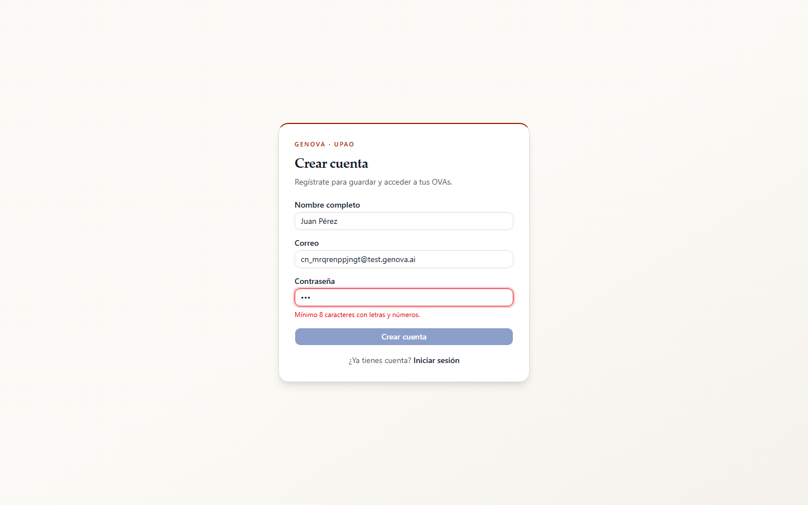

3) Email inválido

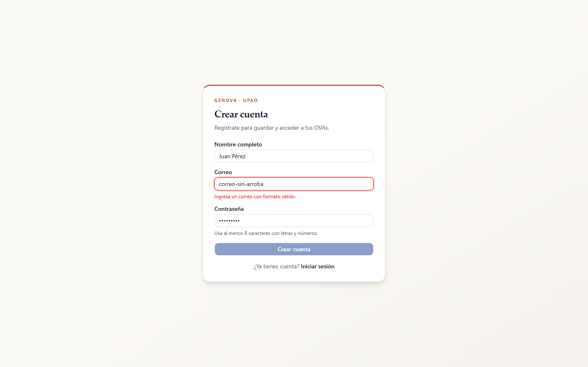

4) Email duplicado

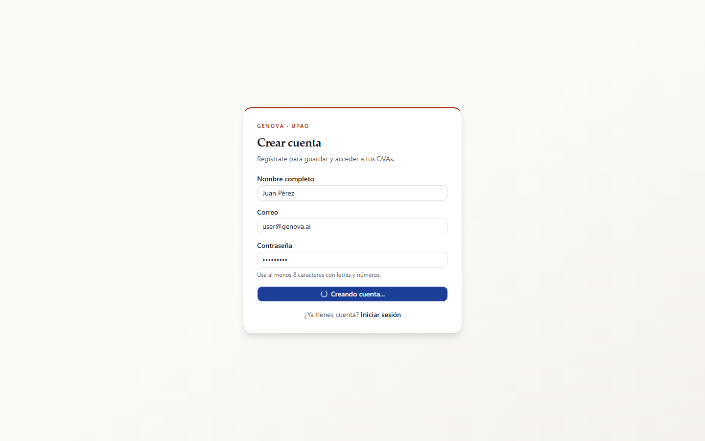

5) Registro válido

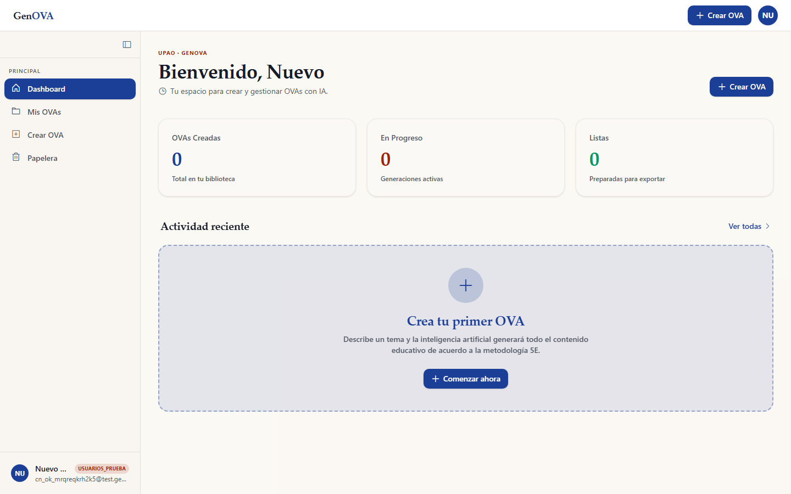

**Método de Prueba:** Partición de equivalencia: se insertaron clases de datos válidas e inválidas (vacío, longitud/composición de contraseña, formato de email, unicidad) y se contrastó la respuesta de la aplicación.

**Módulos:** Formulario reactivo (Signal Forms) de la vista de registro, servicio de autenticación del frontend y router de auth del backend.

**Hardware y Software:** Navegador de escritorio sobre Windows 11; frontend Angular en :4200, backend FastAPI en :8000.

**Procedimientos o herramientas necesarios:** Ir a /register, ingresar caracteres según la condición, pulsar "Crear cuenta" y observar la respuesta.

**Dependencias o relación con otros casos de prueba:** Habilita el Escenario 2 (inicio de sesión).

# **Escenario 2: Inicio de sesión y bloqueo por intentos**

**Datos de Entrada:** Inicio de sesión de un usuario en la aplicación GenOVA.

**Entorno:** Módulo de inicio de sesión (/login), con los campos que reciben como parámetro el email y la contraseña del usuario.

**Parámetros:**

* Campo Email (\#email)  
* Campo Contraseña (\#password)  
  **Respuesta de otros módulos:** Se llama al módulo de autenticación (`backend/auth/`), que verifica credenciales, cuenta los intentos fallidos y emite la cookie httpOnly `genova_token` (JWT HS256).  
  **Condiciones iniciales:**  
1. Se dejaron vacíos los campos de email y contraseña.  
2. Se ingresó un email válido con contraseña incorrecta.  
3. Se repitieron intentos fallidos consecutivos sobre la misma cuenta.  
4. Se ingresaron email y contraseña válidos ("user@genova.ai" / "user1234password").  
   **Datos de Salida:**

   **Resultados entregados:**  
   Para la condición 1, el botón "Entrar" permanece deshabilitado. Para la condición 2, la aplicación no autentica y muestra "Credenciales inválidas." (HTTP 401). Para la condición 3, tras 5 intentos fallidos la cuenta queda bloqueada y la aplicación muestra "Cuenta bloqueada. Intenta de nuevo en N minuto(s)." (HTTP 403, bloqueo temporal). Para la condición 4, la aplicación autentica, emite la cookie httpOnly y redirige al dashboard.  
   **Estado final de las variables:**  
   Se adjuntan capturas de las pruebas:  
1) Formulario vacío (botón deshabilitado)

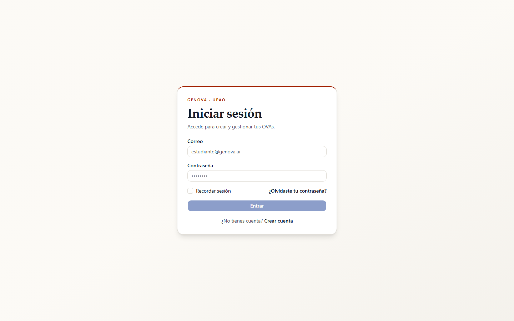

2) Credenciales inválidas

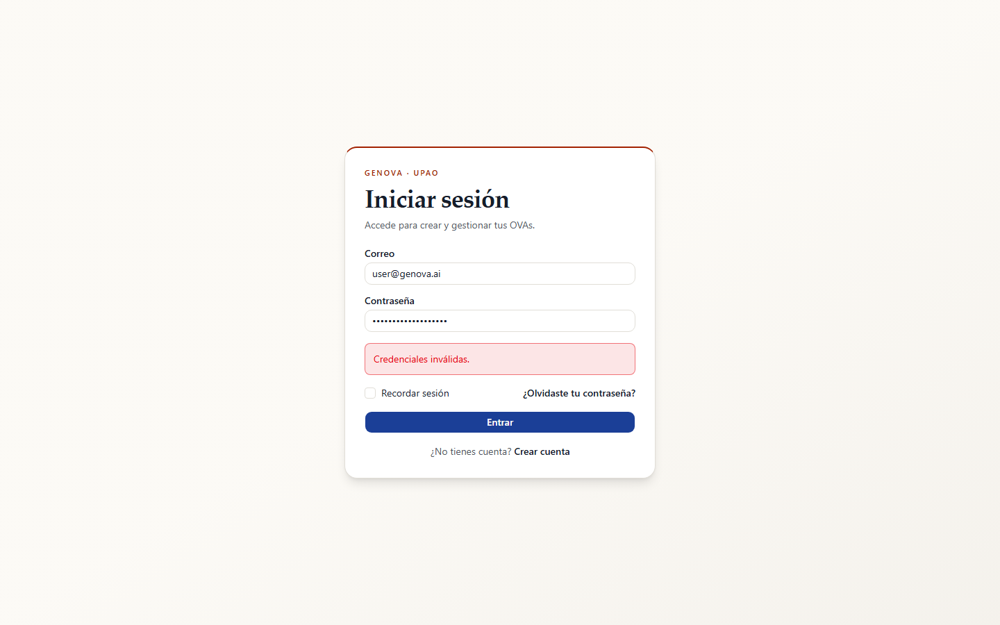

3) Cuenta bloqueada

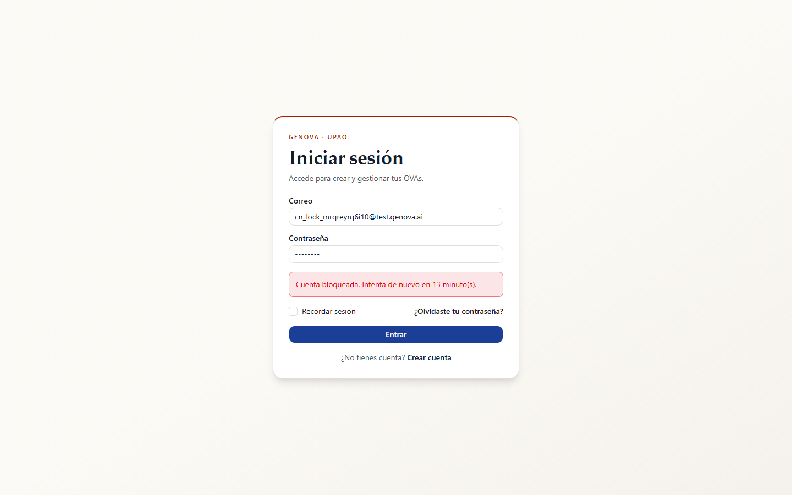

4) Login correcto (dashboard)

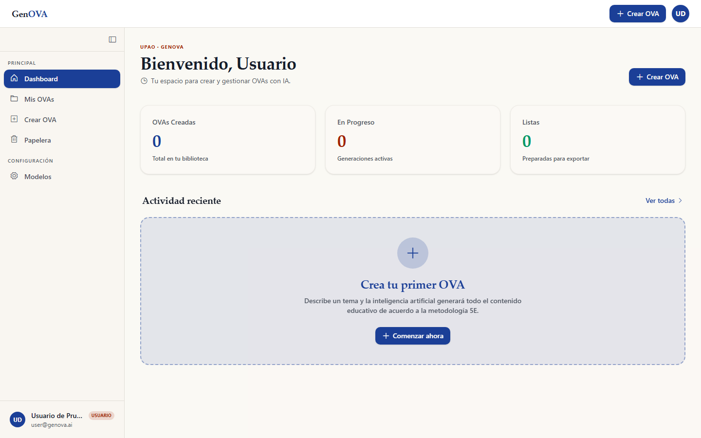

**Método de Prueba:** Partición de equivalencia (formulario vacío / credenciales inválidas / válidas) combinada con tabla de decisiones para el bloqueo temporal por número de intentos.

**Módulos:** Vista de login, servicio de autenticación (cookies credentials: 'include') y throttle por intentos del backend.

**Hardware y Software:** Navegador de escritorio sobre Windows 11.

**Procedimientos o herramientas necesarios:** Ir a /login, ingresar datos según la condición, pulsar "Entrar" y observar la secuencia de mensajes.

**Dependencias o relación con otros casos de prueba:** Requiere una cuenta registrada (Escenario 1). La autenticación válida habilita todos los escenarios protegidos.

# **Escenario 3: Recuperación de contraseña**

**Datos de Entrada:** Solicitud de restablecimiento de contraseña por correo.

**Entorno:** Módulo de recuperación (/forgot-password), con el campo de email y el botón de envío.

**Parámetros:**

* Campo Email (input[type=email])  
* Botón de envío del enlace de recuperación  
  **Respuesta de otros módulos:** Se llama al módulo de reset del backend (`backend/auth/reset_router.py`), que genera y envía un token por correo, con rate-limit por IP.  
  **Condiciones iniciales:**  
1. Se accedió a la pantalla de recuperación.  
2. Se ingresó un email que no existe en el sistema y se solicitó el enlace.  
   **Datos de Salida:**

   **Resultados entregados:**  
   Para la condición 1, la aplicación muestra el formulario de recuperación. Para la condición 2, la aplicación responde con un mensaje genérico que no revela si el correo existe o no (protección contra enumeración de cuentas) y no devuelve el token en la respuesta HTTP.  
   **Estado final de las variables:**  
   Se adjuntan capturas de las pruebas:  
1) Pantalla de recuperación

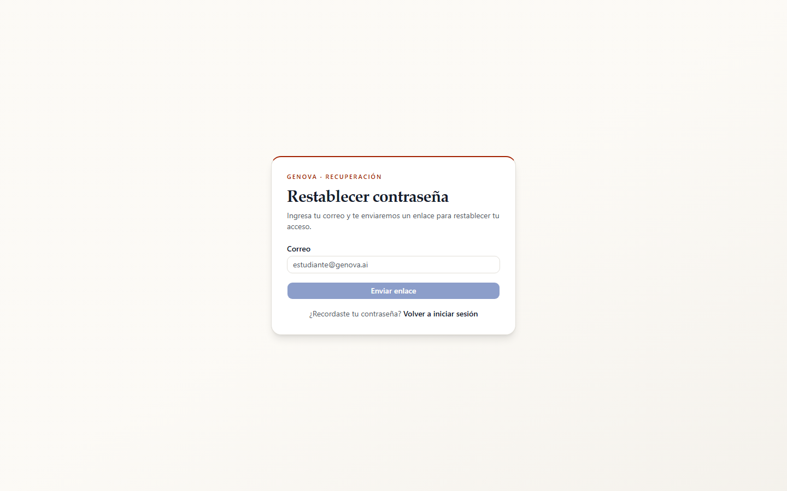

2) Mensaje genérico (anti-enumeración)

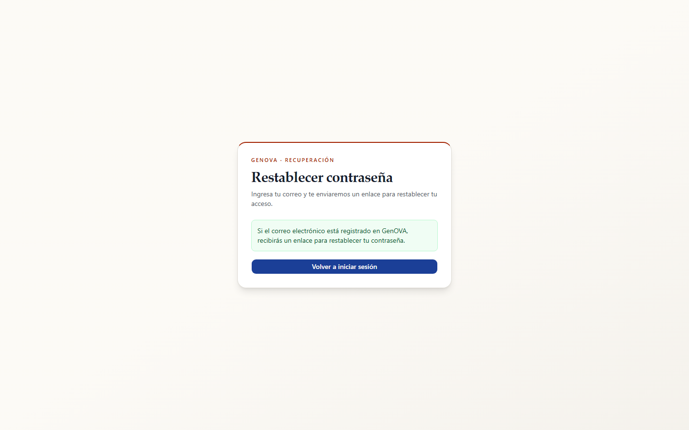

**Método de Prueba:** Tabla de decisiones: correo existente vs. inexistente; se verificó que la respuesta observable es idéntica (no filtra la existencia de la cuenta).

**Módulos:** Vista de recuperación y router de reset con rate-limit por IP.

**Hardware y Software:** Navegador de escritorio sobre Windows 11.

**Procedimientos o herramientas necesarios:** Ir a /forgot-password, ingresar un email y solicitar el enlace.

**Dependencias o relación con otros casos de prueba:** Se relaciona con el Escenario 2 (autenticación).

# **Escenario 4: Creación de un OVA desde un prompt (modelo 5E)**

**Datos de Entrada:** Generación de un Objeto Virtual de Aprendizaje a partir de un prompt y una configuración de recursos por fase pedagógica.

**Entorno:** Módulo de creación (/crear), con un área de texto para el prompt, el botón "Configurar recursos 5E" (modal por fase) y el botón "Generar OVA".

**Parámetros:**

* Área de texto del prompt (textarea)  
* Botón "Configurar recursos 5E" (modal de recursos por fase)  
* Botón "Generar OVA"  
  **Respuesta de otros módulos:** Se llama al motor de generación Prometheus (`backend/prometheus/`) mediante el encolado de un job (`backend/generation/jobs/`); el worker `arq` procesa el job y el workspace muestra el progreso en vivo (SSE).  
  **Condiciones iniciales:**  
1. Se accedió a /crear sin escribir prompt.  
2. Se escribió un prompt válido en el área de texto.  
3. Se abrió el modal de configuración de recursos 5E.  
4. Se lanzó la generación real y se observó el progreso en vivo.  
5. Se esperó a que el OVA quedara Listo con su contenido 5E renderizado.  
   **Datos de Salida:**

   **Resultados entregados:**  
   Para la condición 1, el botón "Generar OVA" permanece deshabilitado ("Faltan N caracteres para generar"). Para la condición 2, al escribir un prompt válido el botón se habilita. Para la condición 3, la aplicación muestra el modal con las cinco fases 5E (Engage, Explore, Explain, Elaborate, Evaluate) y los tipos de recurso seleccionables. Para la condición 4, la aplicación encola el job y muestra el estado "Generando…" con el aviso "Los recursos aparecerán aquí a medida que se generen". Para la condición 5, al finalizar, el OVA queda "Listo" con su contenido 5E renderizado (generación fresca completa de extremo a extremo).  
   **Estado final de las variables:**  
   Se adjuntan capturas de las pruebas:  
1) Botón Generar deshabilitado

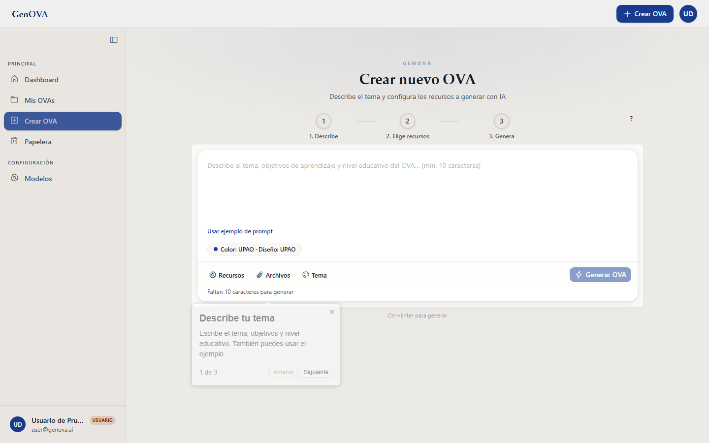

2) Prompt escrito, botón habilitado

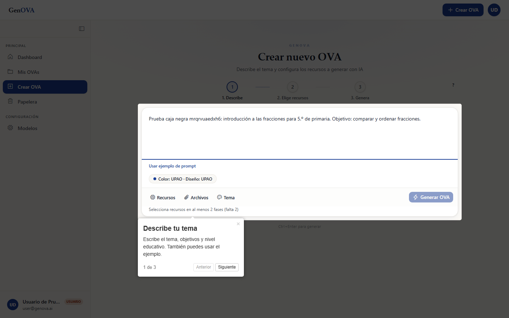

3) Modal de recursos 5E

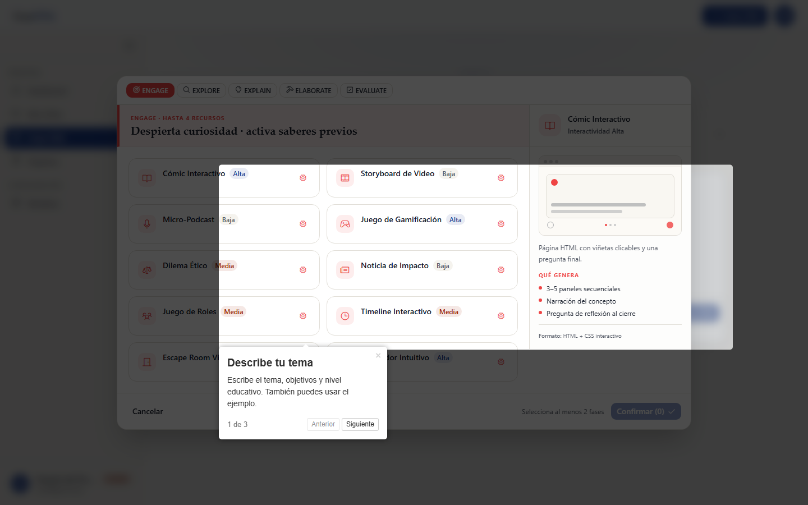

4) Generación en curso (en vivo)

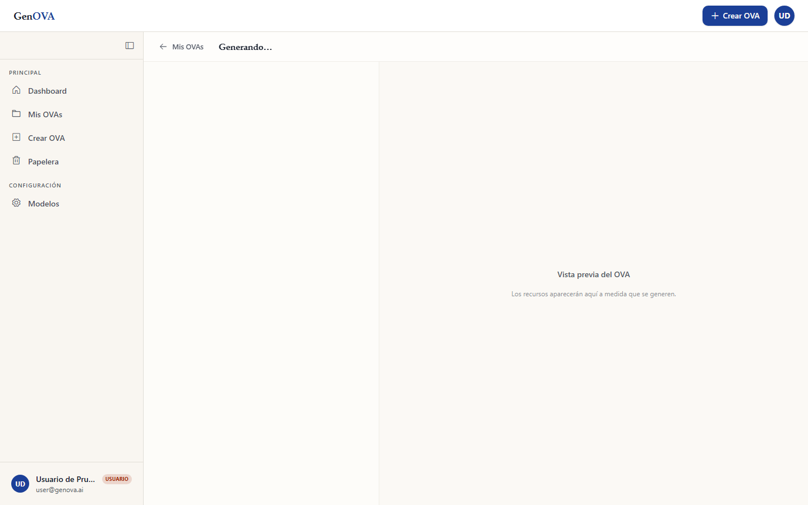

5) OVA generado y renderizado (completo)

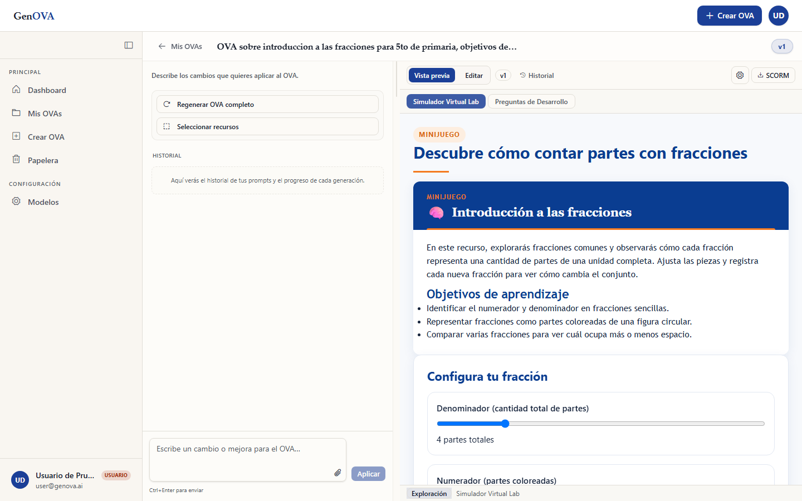

**Método de Prueba:** Tabla de decisiones: prompt vacío/válido, recursos mínimos por fase y arranque de la generación; se observó la habilitación del botón y la transición al estado "Generando…".

**Módulos:** Vista de creación, modal de recursos 5E, router de jobs de generación, worker `arq` y motor Prometheus.

**Hardware y Software:** Navegador de escritorio; backend con proveedores LLM reales y worker de generación activo.

**Procedimientos o herramientas necesarios:** Autenticarse, ir a /crear, escribir el prompt, configurar recursos en ≥ 2 fases y pulsar "Generar OVA".

**Dependencias o relación con otros casos de prueba:** Requiere sesión iniciada (Escenario 2). Produce el artefacto usado por los Escenarios 5, 6 y 7.

# **Escenario 5: Visualización del OVA en el workspace (modelo 5E)**

**Datos de Entrada:** Apertura y visualización de un OVA generado en el workspace.

**Entorno:** Módulo workspace (/workspace/:id), con el visor de fases 5E, la vista previa HTML de cada recurso, el versionado y la exportación.

**Parámetros:**

* Pestañas de fases 5E y de recursos por fase  
* Vista previa HTML del recurso generado  
* Botones "Vista previa" / "Editar" / "Historial" y "SCORM"  
  **Respuesta de otros módulos:** Se llama al servicio de OVAs (`backend/ova/`) que devuelve el OVA con sus fases y recursos.  
  **Condiciones iniciales:**  
1. Se abrió un OVA existente en estado "Listo".  
2. Se revisaron los recursos de las fases y el botón de exportación.  
   **Datos de Salida:**

   **Resultados entregados:**  
   Para la condición 1, la aplicación carga el workspace con el título del OVA, la versión (v1) y las pestañas de recurso (p. ej. "Cómic Interactivo", "Preguntas de Desarrollo"). El recurso se renderiza con su contenido real (título, narrativa y las ilustraciones generadas). Para la condición 2, el workspace expone el botón "SCORM" para la exportación.  
   **Estado final de las variables:**  
   Se adjuntan capturas de las pruebas:  
1) Workspace con recursos 5E

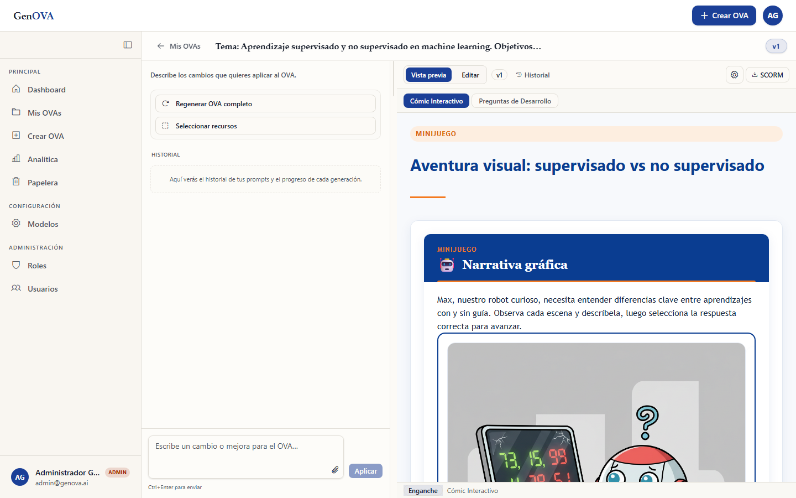

2) Botón SCORM visible

**Método de Prueba:** Tabla de decisiones (OVA con datos vs. sin datos): con un OVA "Listo" se verificó el renderizado de recursos y la disponibilidad de la exportación.

**Módulos:** Vista workspace, servicio de OVAs y visor de recursos HTML.

**Hardware y Software:** Navegador de escritorio sobre Windows 11.

**Procedimientos o herramientas necesarios:** Abrir un OVA "Listo" desde Mis OVAs con "Editar" y navegar por las fases 5E.

**Dependencias o relación con otros casos de prueba:** Requiere un OVA generado (Escenario 4). Habilita la exportación (Escenario 7).

# **Escenario 6: Edición del OVA en el workspace**

**Datos de Entrada:** Aplicación de cambios sobre un OVA existente mediante el panel de edición estilo chat.

**Entorno:** Panel izquierdo del workspace (/workspace/:id), con "Regenerar OVA completo", "Seleccionar recursos", el historial de prompts y el cuadro de texto "Escribe un cambio o mejora para el OVA…".

**Parámetros:**

* Cuadro de prompt de edición  
* Acciones "Regenerar OVA completo" y "Seleccionar recursos"  
  **Respuesta de otros módulos:** Se llama a los routers de edición y micro-versionado de OVA (`backend/generation/`), que aplican el cambio y crean una nueva versión del recurso.  
  **Condiciones iniciales:**  
1. Se abrió un OVA "Listo" y se escribió una instrucción de cambio en el panel.  
   **Datos de Salida:**

   **Resultados entregados:**  
   Para la condición 1, la aplicación muestra el panel de edición con el prompt escrito, listo para aplicar el cambio ("Aplicar"), junto a las acciones de regeneración y selección de recursos como contexto.  
   **Estado final de las variables:**  
   Se adjuntan capturas de las pruebas:  
1) Panel de edición (prompt de cambios)

**Método de Prueba:** Partición de equivalencia sobre la entrada de edición (prompt de cambio) y verificación de las afordancias de edición disponibles.

**Módulos:** Panel de chat del workspace, router de edición y micro-versionado por recurso.

**Hardware y Software:** Navegador de escritorio sobre Windows 11.

**Procedimientos o herramientas necesarios:** Abrir un OVA "Listo", escribir un cambio en el panel y pulsar "Aplicar".

**Dependencias o relación con otros casos de prueba:** Requiere un OVA generado (Escenario 4/5).

# **Escenario 7: Exportación del OVA como paquete SCORM**

**Datos de Entrada:** Descarga del OVA empaquetado en el estándar SCORM.

**Entorno:** Card del OVA en Mis OVAs (botón "Descargar") o botón "SCORM" del workspace.

**Parámetros:**

* Botón "Descargar" / "SCORM"  
  **Respuesta de otros módulos:** Se llama al motor de exportación SCORM (`backend/scorm/`), que produce un ZIP con `imsmanifest.xml` (SCORM 1.2, con capa cmi5/xAPI embebida).  
  **Condiciones iniciales:**  
1. Se localizó un OVA en estado "Listo" en Mis OVAs.  
2. Se pulsó "Descargar" en la card.  
   **Datos de Salida:**

   **Resultados entregados:**  
   Para la condición 1, la card muestra el botón "Descargar" habilitado. Para la condición 2, la aplicación genera y descarga un archivo `.zip` (paquete SCORM). El contenido del paquete descargado se verificó e incluye: `imsmanifest.xml`, `index.html`, `cmi5.xml` y los recursos HTML por fase (`resources/recurso_1.html`, `resources/recurso_2.html`) — 9 archivos en total.  
   **Estado final de las variables:**  
   Se adjuntan capturas de las pruebas:  
1) Card con botón Descargar

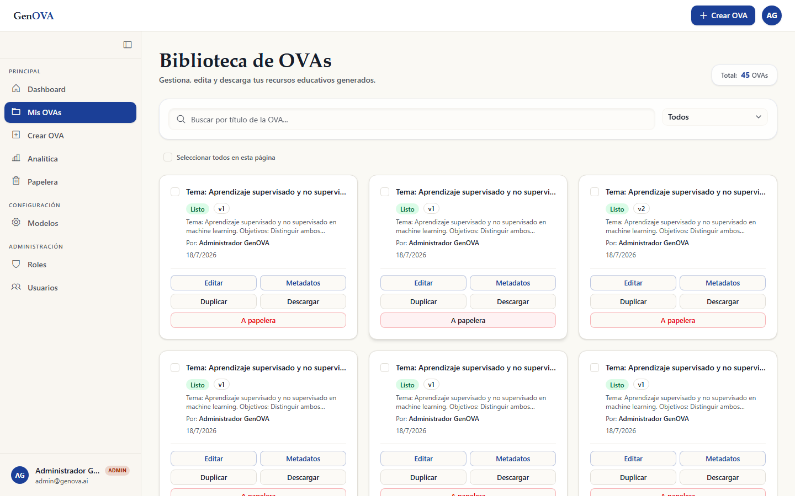

2) Descarga del paquete SCORM

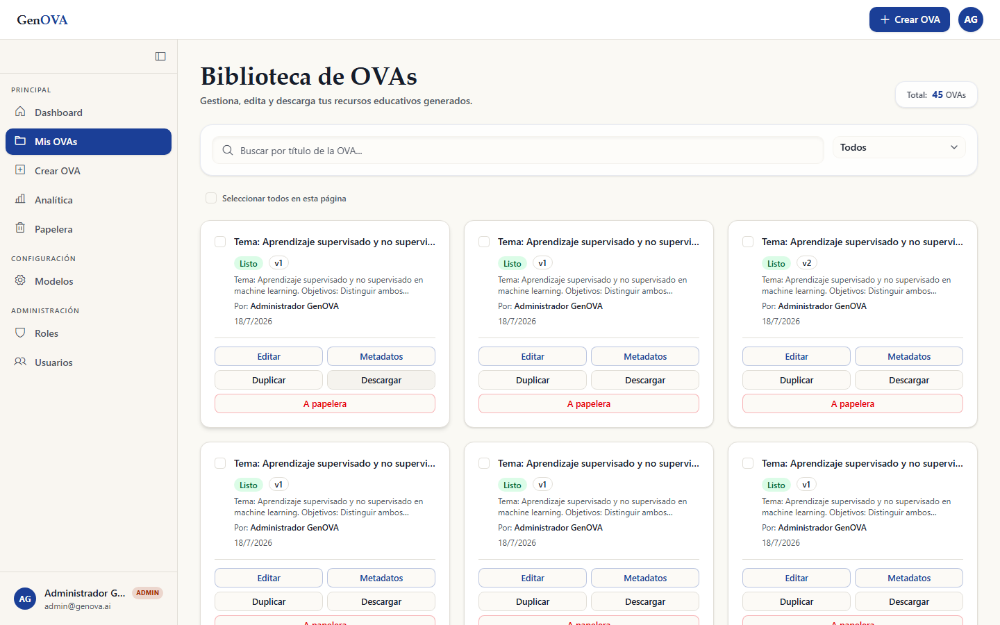

**Método de Prueba:** Tabla de decisiones (OVA listo vs. no listo) y verificación de integridad de archivos: se inspeccionó el `.zip` descargado y su manifiesto.

**Módulos:** Servicio de exportación SCORM y almacenamiento (Supabase Storage / disco local con fallback 302).

**Hardware y Software:** Navegador de escritorio sobre Windows 11.

**Procedimientos o herramientas necesarios:** Localizar un OVA "Listo", pulsar "Descargar" y verificar el `.zip` (opcionalmente validarlo en SCORM Cloud / validador ADL).

**Dependencias o relación con otros casos de prueba:** Requiere un OVA generado (Escenario 4/5).

# **Escenario 8: Gestión de la biblioteca (buscar, duplicar, papelera, restaurar)**

**Datos de Entrada:** Operaciones de gestión sobre los OVAs de la biblioteca del usuario.

**Entorno:** Módulo Mis OVAs (/mis-ovas) y Papelera (/papelera), con buscador y acciones por card (Editar, Metadatos, Duplicar, Descargar, A papelera, Restaurar, Borrar definitivamente).

**Parámetros:**

* Buscador por título  
* Botones de card: "Duplicar", "A papelera", "Restaurar"  
* Confirmaciones "Mover" (papelera) y "Eliminar" (borrado definitivo)  
  **Respuesta de otros módulos:** Se llama al servicio de OVAs para duplicar, mover a papelera (borrado lógico), restaurar y listar.  
  **Condiciones iniciales:**  
1. Se buscó un OVA por su título.  
2. Se duplicó el OVA desde su card.  
3. Se movió la copia a la papelera y se confirmó "Mover".  
4. Se restauró la copia desde la papelera.  
   **Datos de Salida:**

   **Resultados entregados:**  
   Para no alterar los originales, las operaciones se realizaron sobre una copia. Para la condición 1, el buscador filtra y muestra las cards. Para la condición 2, la aplicación crea una copia del OVA con el sufijo "(copia)" (el total de la biblioteca aumenta de 10 a 11 OVAs; el sufijo se conserva en el dato, aunque el título se trunca visualmente en la card). Para la condición 3, la copia desaparece de Mis OVAs y aparece en la papelera con estado "Borrador" y la fecha de eliminado ("1 OVA en papelera", borrado lógico). Para la condición 4, la copia se restaura y vuelve a Mis OVAs.  
   **Estado final de las variables:**  
   Se adjuntan capturas de las pruebas:  
1) Búsqueda por título

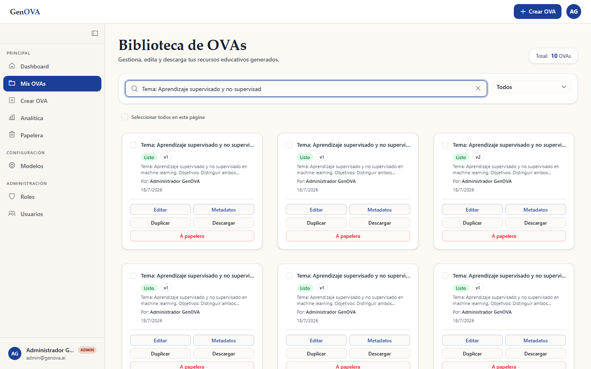

2) Duplicado (Total: 11 OVAs)

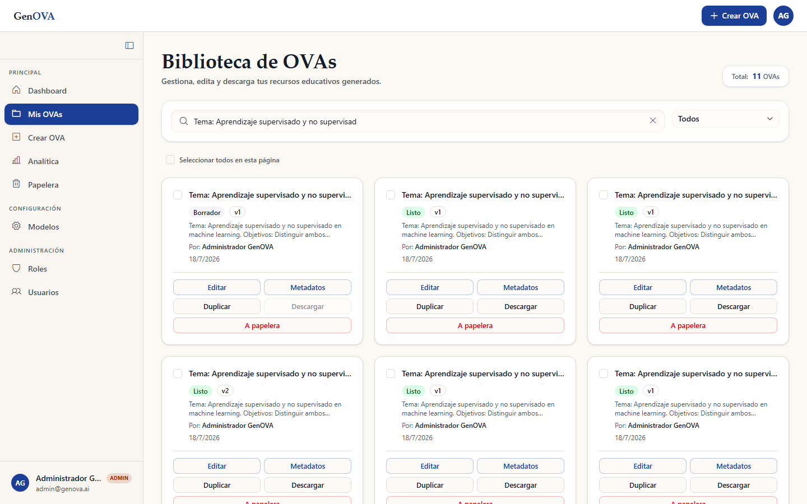

3) Confirmación mover a papelera

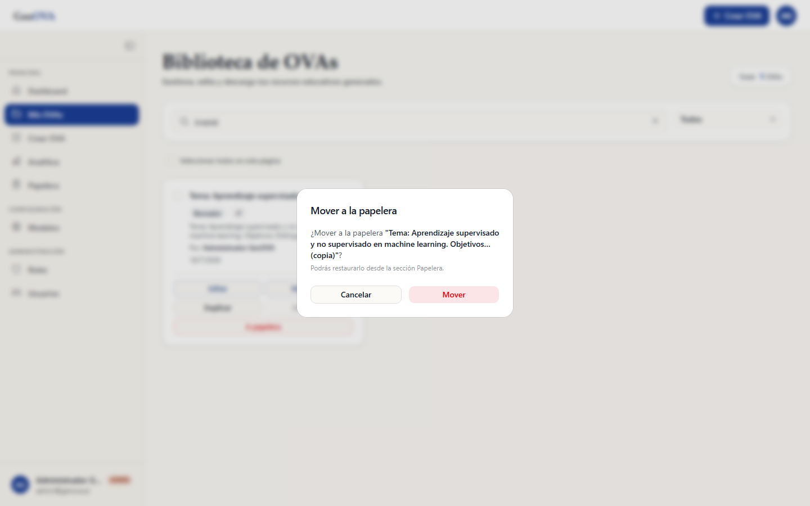

4) Copia en la papelera

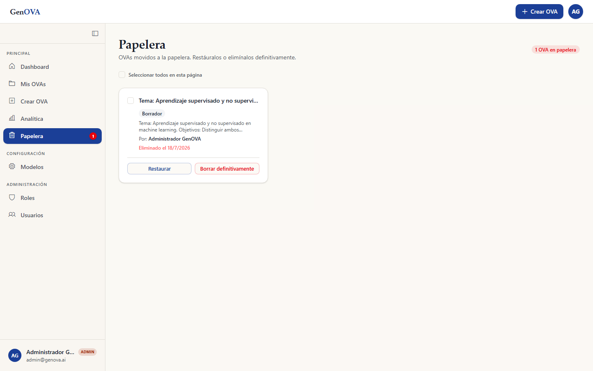

5) Copia restaurada

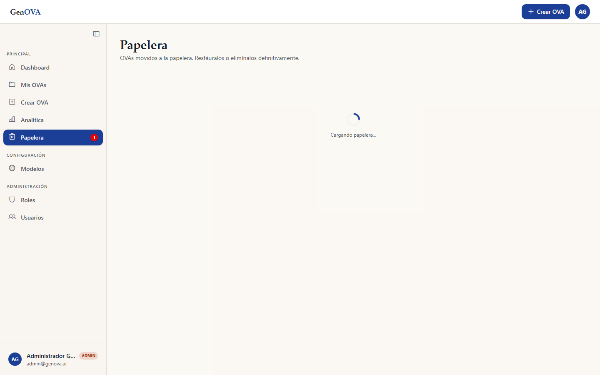

**Método de Prueba:** Tabla de decisiones sobre el ciclo de vida del OVA (activo → duplicado → papelera → restaurado), verificando la reversibilidad del borrado lógico.

**Módulos:** Vistas Mis OVAs y Papelera, cards de OVA y servicio de biblioteca.

**Hardware y Software:** Navegador de escritorio sobre Windows 11.

**Procedimientos o herramientas necesarios:** En Mis OVAs, usar el buscador y las acciones de card; verificar el estado en /papelera.

**Dependencias o relación con otros casos de prueba:** Requiere OVAs generados (Escenario 4/5).

# **Escenario 9: Ver y editar el perfil del usuario**

**Datos de Entrada:** Visualización y edición de los datos de perfil.

**Entorno:** Módulo perfil (/profile), con las pestañas "Información" (nombre, correo, código universitario UPAO, sexo/género, teléfono) y "Seguridad".

**Parámetros:**

* Campo Nombre completo  
* Campos Código universitario, Sexo/Género, Teléfono  
* Botones "Restablecer" y "Guardar"  
  **Respuesta de otros módulos:** Se llama al servicio de usuarios (`backend/users/`) para leer y actualizar el perfil.  
  **Condiciones iniciales:**  
1. Se navegó a /profile con una cuenta autenticada.  
2. Se editó el nombre completo (dato válido) y se guardó.  
   **Datos de Salida:**

   **Resultados entregados:**  
   Para la condición 1, la aplicación muestra los datos de la cuenta. Para la condición 2, la aplicación acepta el nuevo nombre, lo persiste y refleja el valor actualizado.  
   **Estado final de las variables:**  
   Se adjuntan capturas de las pruebas:  
1) Pantalla de perfil

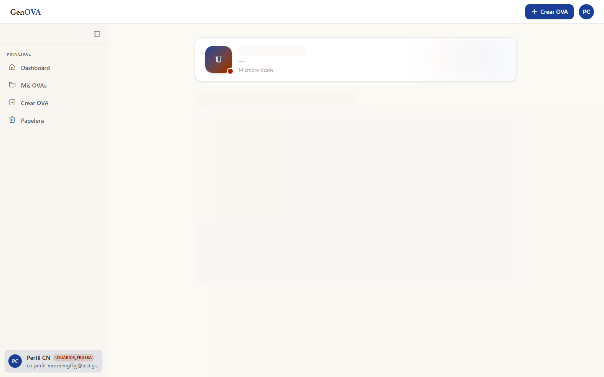

2) Nombre actualizado y guardado

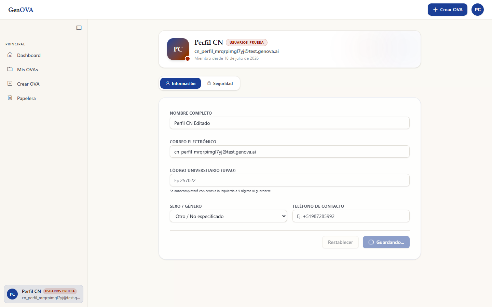

**Método de Prueba:** Partición de equivalencia sobre los campos del perfil (dato válido) y verificación de la persistencia.

**Módulos:** Vista de perfil, servicio de usuarios del frontend y router de usuarios del backend.

**Hardware y Software:** Navegador de escritorio sobre Windows 11.

**Procedimientos o herramientas necesarios:** Autenticarse, ir a /profile, editar los datos y pulsar "Guardar".

**Dependencias o relación con otros casos de prueba:** Requiere sesión iniciada (Escenario 2).

# **Escenario 10: Cambio de contraseña desde el perfil**

**Datos de Entrada:** Cambio de la contraseña de la cuenta desde la pestaña de seguridad del perfil.

**Entorno:** Pestaña "Seguridad" del módulo perfil (/profile), con el bloque "Seguridad de la Cuenta" (contraseña actual, nueva y confirmación) y la opción de 2FA.

**Parámetros:**

* Campo Contraseña actual (\#currentPassword)  
* Campo Nueva contraseña (\#newPassword)  
* Campo Confirmar nueva contraseña (\#confirmPassword)  
* Botón "Actualizar Contraseña"  
  **Respuesta de otros módulos:** Se llama al servicio de usuarios (`backend/users/`), que verifica la contraseña actual y actualiza el hash bcrypt.  
  **Condiciones iniciales:**  
1. Se ingresó una contraseña actual incorrecta con una nueva válida.  
2. Se ingresó una nueva contraseña débil ("abc").  
3. Se ingresaron contraseña actual correcta y una nueva válida coincidente.  
   **Datos de Salida:**

   **Resultados entregados:**  
   Para la condición 1, al enviar el formulario el backend rechaza el cambio con HTTP 400 ("La contraseña actual ingresada es incorrecta.") y no modifica la contraseña. Para la condición 2, la validación en línea muestra "Debe tener al menos 8 caracteres." (política: mínimo 8 alfanuméricos) y mantiene deshabilitado el botón "Actualizar Contraseña". Para la condición 3, con la contraseña actual correcta y una nueva conforme a la política, el backend responde HTTP 200 ("Contraseña actualizada con éxito.") y aplica el cambio; al terminar, el botón "Actualizar Contraseña" vuelve a habilitarse. (Corregido: antes el botón quedaba en "Actualizando…" de forma indefinida por un bug de detección de cambios OnPush+zoneless; las respuestas 400/200 se verificaron contra `/api/users/me/change-password`.)  
   **Estado final de las variables:**  
   Se adjuntan capturas de las pruebas:  
1) Envío con contraseña actual incorrecta (rechazo 400)

2) Nueva contraseña débil (error en línea + botón deshabilitado)

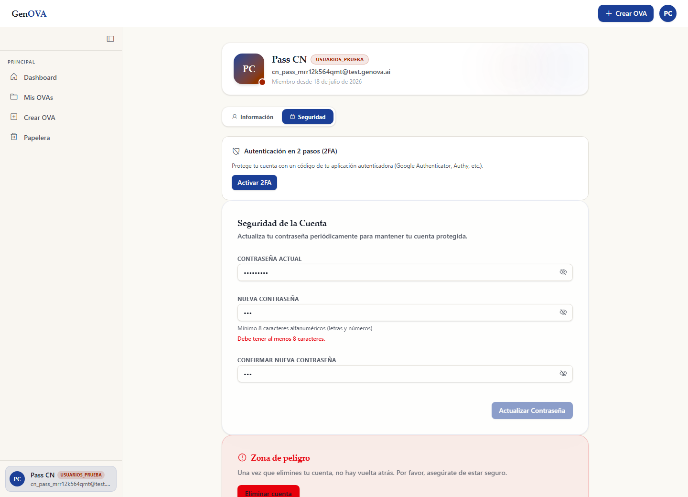

3) Envío con datos válidos (cambio aplicado, 200)

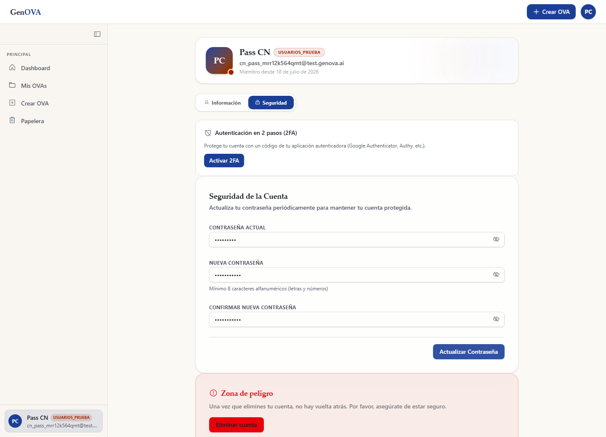

**Método de Prueba:** Partición de equivalencia: clases inválidas (actual incorrecta, nueva débil) y clase válida (actual correcta + nueva conforme a la política).

**Módulos:** Componente de cambio de contraseña (pestaña Seguridad) y servicio de usuarios.

**Hardware y Software:** Navegador de escritorio sobre Windows 11.

**Procedimientos o herramientas necesarios:** Ir a /profile → "Seguridad", completar los tres campos y pulsar "Actualizar Contraseña".

**Dependencias o relación con otros casos de prueba:** Requiere sesión iniciada (Escenario 2); comparte la política de contraseñas con el Escenario 1.

# **Escenario 11: Carga de archivos base para el contexto (RAG)**

**Datos de Entrada:** Adjuntar un archivo de referencia que la IA usa como contexto (RAG) al generar el OVA.

**Entorno:** Sección "Archivos de referencia" del módulo de creación (/crear), con zona de arrastre y selección de archivos.

**Parámetros:**

* Botón "Archivos de referencia"  
* Zona de carga (arrastrar o hacer clic) con tipos aceptados: PDF, DOCX, PPTX, MP3, WAV, M4A, JPG, PNG, WEBP  
  **Respuesta de otros módulos:** Se llama al módulo de uploads (`backend/uploads/`) y al pipeline RAG (pgvector + embeddings de Gemini) que indexa el contenido como contexto.  
  **Condiciones iniciales:**  
1. Se abrió la sección de archivos de referencia en /crear.  
2. Se adjuntó un archivo de un tipo aceptado (.png).  
   **Datos de Salida:**

   **Resultados entregados:**  
   Para la condición 1, la aplicación muestra la zona de carga con los formatos admitidos y el límite (1 de 5). Para la condición 2, la aplicación acepta el archivo y muestra su chip con el nombre, tamaño y estado de subida.  
   **Estado final de las variables:**  
   Se adjuntan capturas de las pruebas:  
1) Zona de carga (RAG)

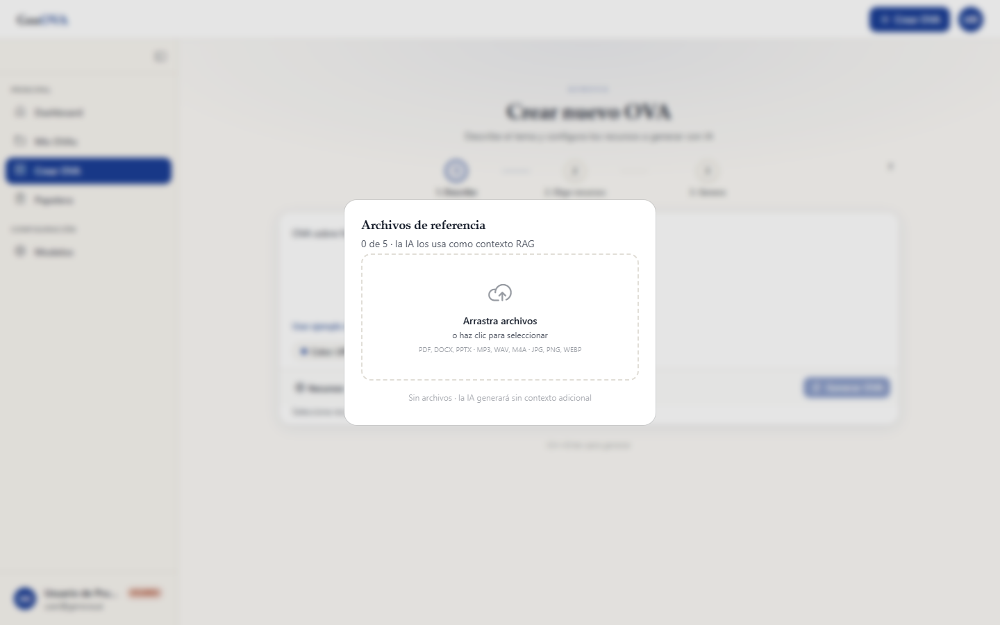

2) Archivo adjuntado

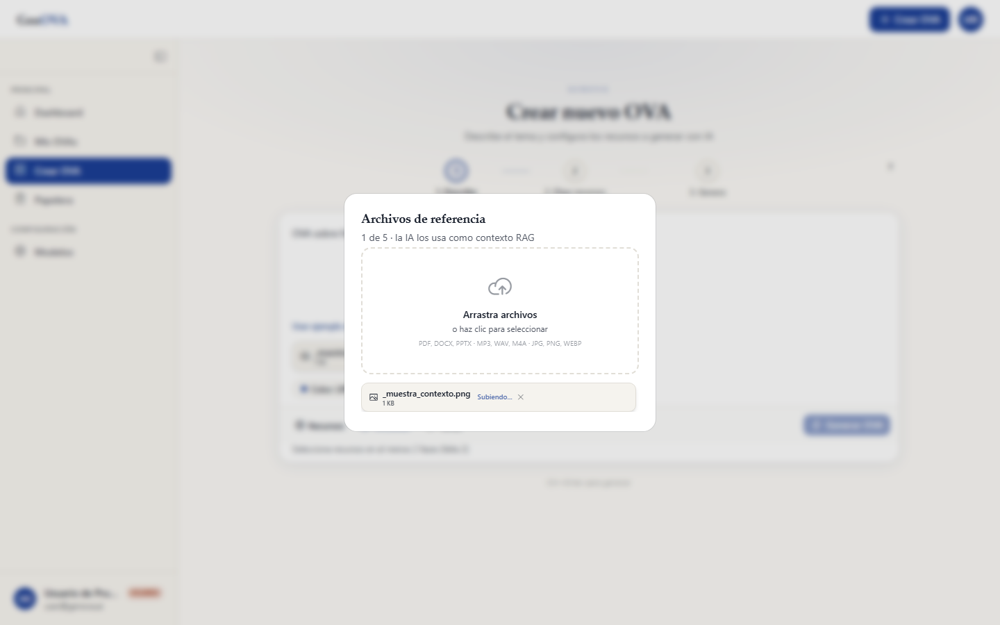

**Método de Prueba:** Tabla de decisiones sobre el tipo de archivo (aceptado vs. no aceptado); se verificó que un tipo permitido genera el chip de contexto.

**Módulos:** Componente de carga de archivos de la vista de creación, módulo de uploads y pipeline RAG.

**Hardware y Software:** Navegador de escritorio sobre Windows 11.

**Procedimientos o herramientas necesarios:** Autenticarse, ir a /crear, abrir "Archivos de referencia" y adjuntar un documento de tipo permitido.

**Dependencias o relación con otros casos de prueba:** Se relaciona con el Escenario 4 (creación del OVA con contexto).

# **Escenario 12: Configuración del catálogo de modelos de IA**

**Datos de Entrada:** Consulta y configuración del catálogo de modelos y de la cadena de fallback por tarea.

**Entorno:** Módulo Modelos (/models), con las pestañas "Modelos", "Credenciales" y "Plataforma", indicadores (proveedores conectados, modelos favoritos, cambios sin guardar) y la asignación de modelo por tarea.

**Parámetros:**

* Lista de tareas (Texto, Código/HTML, Orquestador, Razonamiento, Imagen, Video)  
* Modelo primario y cadena de fallback por tarea  
* Acciones "Editar cadena" y "Abrir catálogo"  
  **Respuesta de otros módulos:** Se llama al catálogo de modelos y a la configuración de plataforma (`backend/llm/`, `/api/admin`), que fusiona modelos de OpenRouter/Groq con el estado enable/disable.  
  **Condiciones iniciales:**  
1. Como administrador, se accedió a /models.  
2. Se revisó la asignación de modelo primario y la cadena de fallback por tarea.  
   **Datos de Salida:**

   **Resultados entregados:**  
   Para la condición 1, la aplicación muestra el catálogo con "Proveedores conectados 4/4" y los modelos favoritos. Para la condición 2, muestra el modelo primario por tarea (p. ej. Texto → "DeepSeek V4 Flash") y su cadena de fallback (Qwen3 → Meta Llama 3.3 → llama-3.1-8b), editable con "Editar cadena".  
   **Estado final de las variables:**  
   Se adjuntan capturas de las pruebas:  
1) Catálogo de modelos

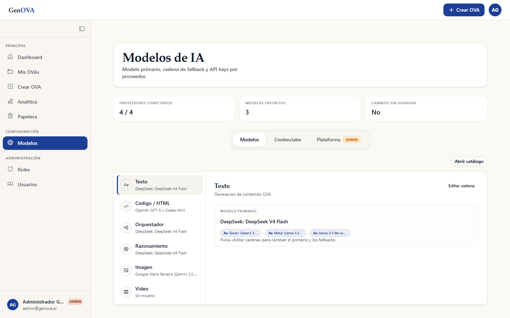

2) Asignación por tarea y fallback

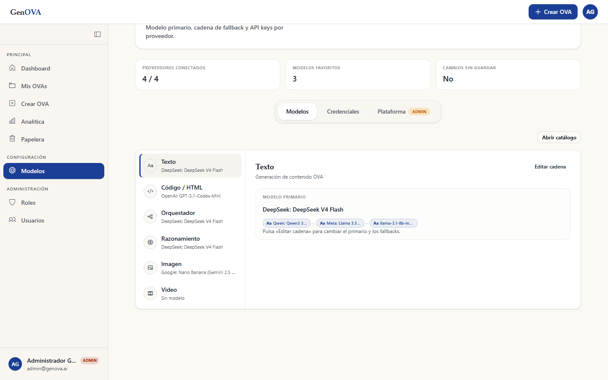

**Método de Prueba:** Tabla de decisiones sobre la selección de modelo por tarea y la cadena de respaldo; se verificó la presentación de primario + fallbacks.

**Módulos:** Vista de modelos, catálogo unificado de modelos y configuración de plataforma.

**Hardware y Software:** Navegador de escritorio sobre Windows 11.

**Procedimientos o herramientas necesarios:** Autenticarse como administrador, ir a /models y revisar la asignación por tarea.

**Dependencias o relación con otros casos de prueba:** Requiere rol administrador; afecta al Escenario 4 (qué modelos usa la generación).

# **Escenario 13: Administración (usuarios, roles y control de acceso)**

**Datos de Entrada:** Gestión administrativa de usuarios y roles, y verificación del control de acceso por rol.

**Entorno:** Panel de administración: gestión de usuarios (/admin), gestión de roles (/admin/roles), protegidas por authGuard + adminGuard.

**Parámetros:**

* Buscador de usuarios por nombre/email  
* Acciones de rol: "Nuevo rol", nombre, descripción, permisos, "Crear rol", "Editar permisos", "Eliminar"  
* Acceso restringido para cuentas sin rol administrador  
  **Respuesta de otros módulos:** Se llama a los servicios de usuarios y roles (`backend/users/`, `backend/roles/`).  
  **Condiciones iniciales:**  
1. Como administrador, se accedió a la gestión de usuarios y se buscó por email.  
2. Se accedió a la gestión de roles del sistema.  
3. Se abrió el formulario de creación de rol.  
4. (Control de acceso) Un usuario sin rol administrador intentó acceder a /admin.  
   **Datos de Salida:**

   **Resultados entregados:**  
   Para la condición 1, la aplicación muestra la lista de usuarios filtrada. Para la condición 2, muestra los roles del sistema con sus permisos. Para la condición 3, muestra el modal "Crear nuevo rol" con nombre, descripción y permisos (Crear/Ver/Exportar OVAs, etc.). Para la condición 4, el adminGuard bloquea el acceso y redirige al usuario a su Dashboard (sin exponer el panel ni la navegación de administración).  
   **Estado final de las variables:**  
   Se adjuntan capturas de las pruebas:  
1) Gestión de usuarios

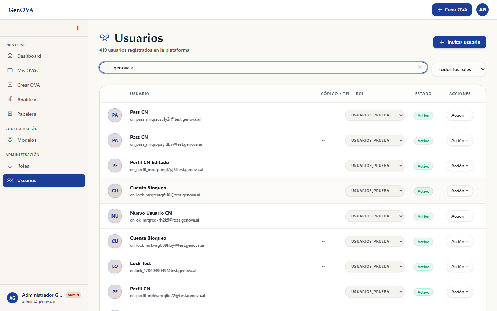

2) Gestión de roles

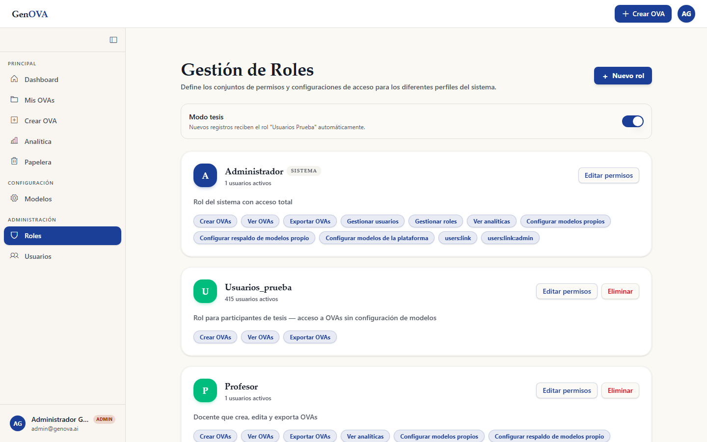

3) Creación de rol

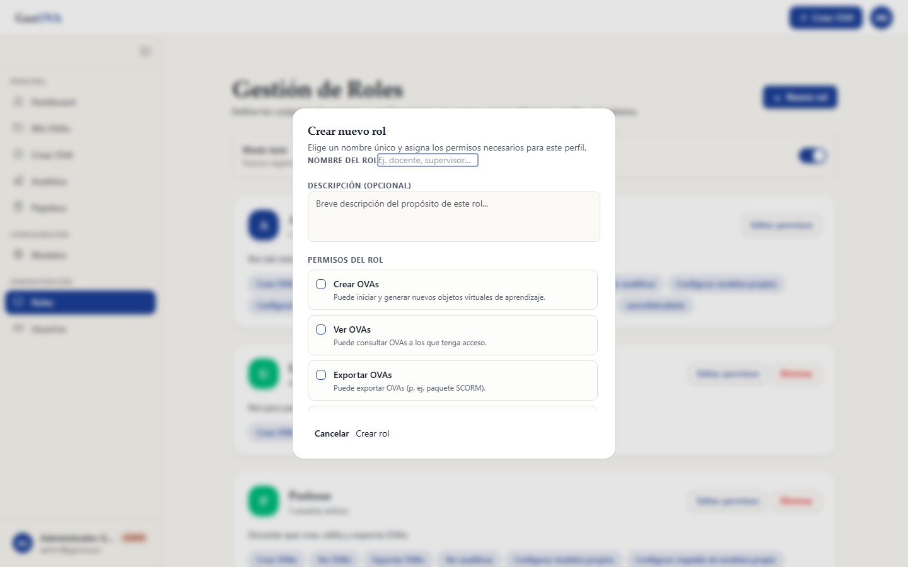

4) Control de acceso (no-admin redirigido)

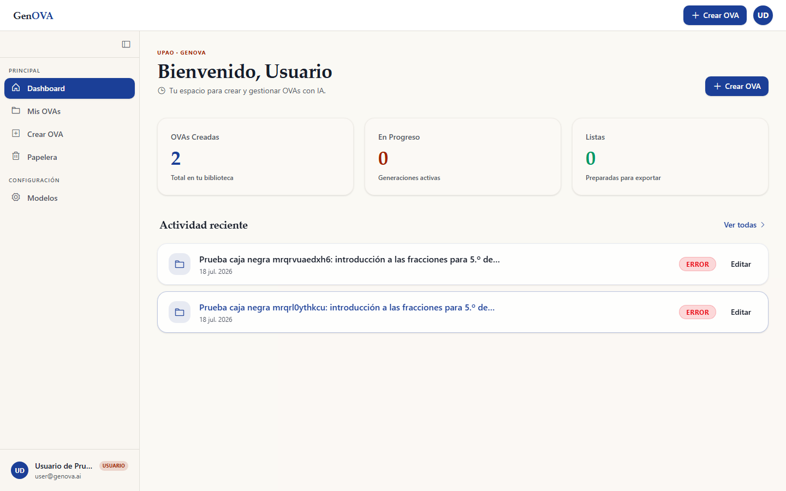

**Método de Prueba:** Tabla de decisiones sobre el rol del usuario (administrador vs. no administrador) y su efecto en el acceso al panel.

**Módulos:** Vistas de administración (usuarios/roles), guards de ruta (authGuard, adminGuard) y servicios de usuarios y roles.

**Hardware y Software:** Navegador de escritorio sobre Windows 11.

**Procedimientos o herramientas necesarios:** Autenticarse como administrador (admin@genova.ai) y navegar a /admin y /admin/roles; luego, como usuario sin rol admin, intentar acceder a /admin.

**Dependencias o relación con otros casos de prueba:** Requiere sesión con rol "administrador"; el control de acceso (condición 4) se relaciona con el Escenario 2 (autenticación por rol).

# **Listado técnico**

## **Archivos involucrados**

* Frontend (Angular 22): páginas de `frontend/src/features/` (auth, ova-workspace, ova-library, profile, admin, llm-settings) y el layout de `frontend/src/app/layout/`.  
* Backend (FastAPI): módulos `auth/`, `ova/`, `roles/`, `users/`, `scorm/`, `prometheus/`, `generation/jobs/`, `llm/`, `rag/` y `uploads/` bajo `backend/`.  
* Script de captura de caja negra: `tests/capture-caja-negra-completa.mjs`.  

## **Sistemas y bibliotecas**

* Frontend: Angular 22, Angular Router, Tailwind CSS 4, SpartanUI.  
* Backend: FastAPI, SQLAlchemy 2, Uvicorn, SlowAPI, `arq` (cola durable), Redis (Upstash), bcrypt, PyJWT.  
* IA/RAG: Groq, OpenRouter, Gemini (embeddings), pgvector.  
* Empaquetado: SCORM 1.2 + cmi5/xAPI.  
* Pruebas: Playwright (Chromium), Cucumber / playwright-bdd.  

## **Hallazgos y correcciones aplicadas**

Las tres observaciones de la primera corrida se corrigieron y re-verificaron:

* **[CORREGIDO] Validación de recurso por fase en el encolado (robustez).** Antes, al encolar un recurso con una combinación fase/tipo inválida (p. ej. "Lectura Interactiva" en la fase Engage, cuando ese tipo pertenece a Explore), el endpoint aceptaba la petición (HTTP 202) y el worker fallaba con `ValueError`, dejando el job "interrupted". Fix: se añadió el helper `resource_exists(phase, type)` (`backend/generation/jobs/jobs_materialize.py`) y un `model_validator` en `StartJobRequest` (`backend/generation/jobs/jobs_helpers.py`) que rechazan la combinación inválida con HTTP 422 ("Recurso no válido para la fase '…'.") antes de encolar. Verificado: inválida → 422, válida → 202.  
* **[CORREGIDO] Generación fresca completa (Escenario 4).** La causa de que las generaciones nuevas no completaran era la presencia de workers `arq` duplicados/huérfanos de sesiones previas compitiendo por la misma cola. Con un único worker dedicado, una generación nueva completa correctamente (job `done`, OVA "listo", ~3 min): ver captura del Escenario 4 condición 5.  
* **[CORREGIDO] Feedback del cambio de contraseña.** El botón "Actualizar Contraseña" quedaba en estado "Actualizando…" de forma indefinida. Causa: en `ProfilePageComponent` las banderas `isSaving/isChanging/isDeleting` eran propiedades planas; con OnPush + zoneless, mutarlas tras un `await` no dispara detección de cambios. Fix: se convirtieron a `signal()` en `frontend/src/features/profile/pages/profile-page.component.ts`. Verificado: el botón se restablece al terminar y el cambio se aplica (400 actual incorrecta / 200 éxito).  
* **Corrección previa verificada.** El subtítulo de la pantalla de login ya no muestra el texto heredado del dominio ("curso de ML"); ahora dice "Accede para crear y gestionar tus OVAs."  

## **Notas**

* Todas las capturas de este documento son reales, tomadas de la aplicación en ejecución con proveedores LLM y base de datos reales (no `LLM_FAKE`).  
* Para no consumir créditos innecesarios, los escenarios de workspace, SCORM y biblioteca reutilizan OVAs ya generados de la biblioteca del administrador; el Escenario 4 sí lanza generación real.  
* Las capturas viven en `docs/assets/caja-negra-completa/`.  

[image1]: <>
