# Anexo: Documento de Pruebas de Caja Negra — GenOVA

## Tipo de prueba a realizar: Pruebas de Caja Negra (funcionales)

**Descripción.** Se documenta lo que se probó (funcionalidad observable) sin
mirar el código interno de los módulos, evaluando: las interfaces, la respuesta
a las entradas del usuario, la integridad de los archivos generados (paquete
SCORM), distintos escenarios válidos e inválidos, las respuestas de la
aplicación y la secuencia de mensajes mostrados.

**Entorno de ejecución de las pruebas.** GenOVA es una aplicación web (no móvil).
Las pruebas se ejecutaron contra el stack local con datos y sesiones reales:

| Componente | Detalle |
|---|---|
| Frontend | Angular 22 servido en `http://localhost:4300` |
| Backend | FastAPI (`uvicorn`) en `http://localhost:8001`, con `LLM_FAKE=1` (HTML determinista, sin proveedores LLM) y `RATE_LIMIT_ENABLED=0` |
| Base de datos | Supabase PostgreSQL (pooler de transacción) |
| Automatización de capturas | Playwright (Chromium headless), viewport 1440×900 |
| Cuentas de prueba (seed) | `admin@genova.ai` / `admin1234password` · `user@genova.ai` / `user1234password` |
| Sistema operativo | Windows 11 |

Las capturas de cada escenario se generaron con el script
[`tests/capture-caja-negra.mjs`](https://github.com/GenOVA-UPAO/GenOVA/blob/develop/tests/capture-caja-negra.mjs),
que reutiliza los mismos selectores de la suite E2E
([`tests/steps/e2e/`](https://github.com/GenOVA-UPAO/GenOVA/tree/develop/tests/steps/e2e)).

---

## Escenario 1: Registro de nuevo usuario

**Datos de Entrada.** Registro de un nuevo usuario en la aplicación GenOVA.

**Entorno.** Para el registro se tiene el módulo de registro (`/register`), con
los campos que almacenan el ingreso del nombre completo, correo electrónico y
contraseña del usuario.

**Parámetros.**

- Campo Nombre completo (`#fullName`)
- Campo Email (`#email`)
- Campo Contraseña (`#password`)

**Respuesta de otros módulos.** Se llama al módulo de registro de usuario
([`backend/auth/router.py`](https://github.com/GenOVA-UPAO/GenOVA/blob/develop/backend/auth/router.py)),
que normaliza el email, valida y persiste la cuenta con la contraseña cifrada
(bcrypt).

**Condiciones iniciales.**

1. Se dejaron nulos (vacíos) los campos de nombre, email y contraseña y se pulsó "Crear cuenta".
2. Se ingresó una contraseña de 3 caracteres sin números ("abc").
3. Se ingresó un email sin `@` ni dominio ("correo-sin-arroba").
4. Se ingresó un email ya registrado ("user@genova.ai") con contraseña válida.
5. Se ingresó nombre válido, email único válido y contraseña "Clave1234" (≥ 8, con letras y números).

**Datos de Salida — Resultados entregados.**

Para la **condición 1**, la aplicación **no permite** el envío y **muestra**
mensajes de campo requerido; permanece en `/register`. Para la **condición 2**,
**no permite** el registro y **muestra** el mensaje "Mínimo 8 caracteres con
letras y números". Para la **condición 3**, **no permite** el registro y
**muestra** un error de formato de email. Para la **condición 4**, el backend
**rechaza** el registro por email ya existente. Para la **condición 5**, la
aplicación **permite** el registro: crea la cuenta y, según la configuración,
inicia sesión con la cookie httpOnly o muestra el aviso de verificación de
correo.

**Estado final de las variables.** Se adjuntan capturas de las pruebas:

| Condición | Captura |
|---|---|
| 1 — Campos vacíos | 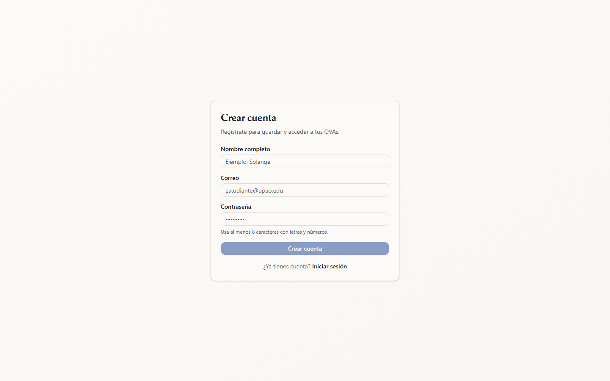 |
| 2 — Contraseña débil | 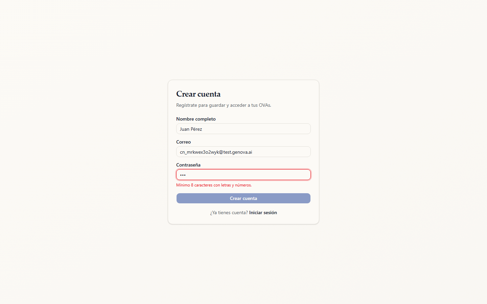 |
| 3 — Email inválido | 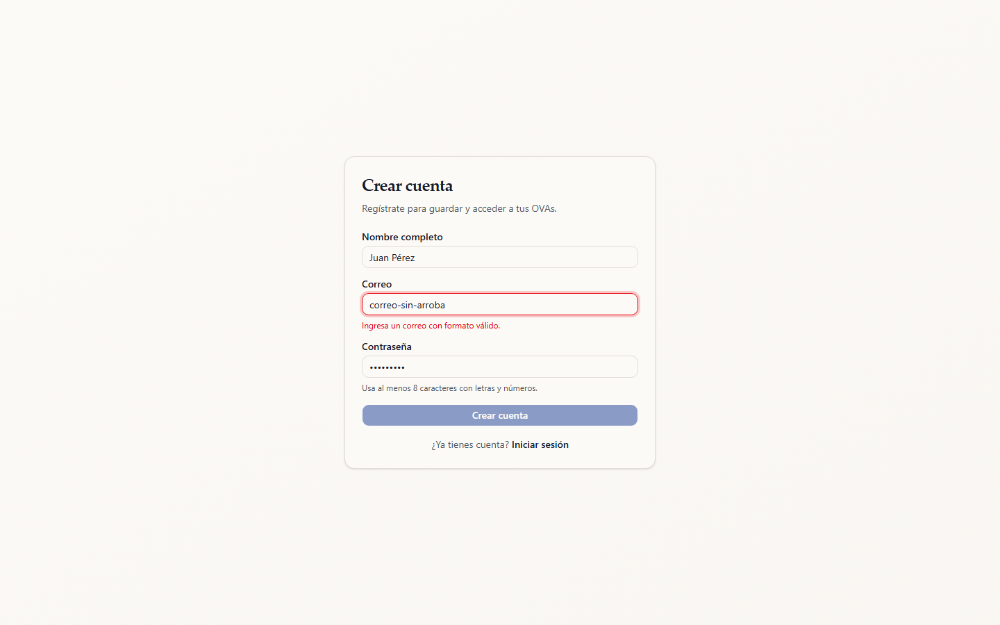 |
| 4 — Email duplicado | 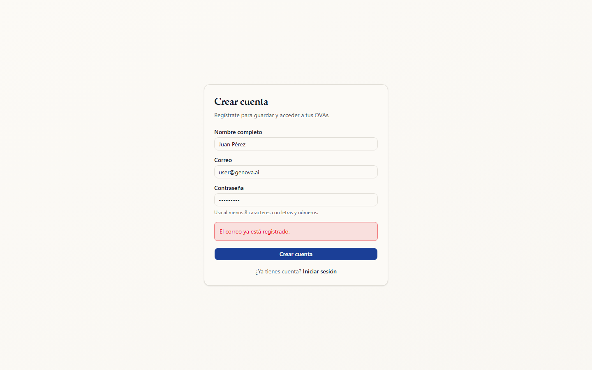 |
| 5 — Registro válido | 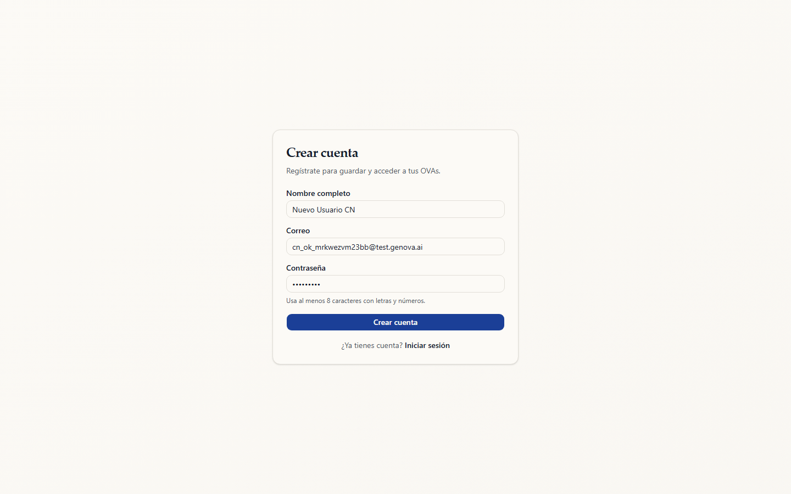 |

**Hardware y Software.** Navegador de escritorio sobre Windows 11; frontend
Angular en `:4300`, backend FastAPI en `:8001`.

**Procedimientos o herramientas necesarios.** Ir al módulo de registro
(`/register`), ingresar caracteres alfanuméricos y/o especiales según la
condición, pulsar "Crear cuenta" y observar la respuesta de la aplicación.

**Dependencias o relación con otros casos de prueba.** Se debe situar en la
sección de registro. Dependiendo del llenado correcto de los campos y de la
unicidad del email, se registra o no una nueva cuenta. Habilita el Escenario 2
(inicio de sesión).

---

## Escenario 2: Inicio de sesión y bloqueo por intentos

**Datos de Entrada.** Inicio de sesión de un usuario en la aplicación GenOVA.

**Entorno.** Módulo de inicio de sesión (`/login`), con los campos que reciben
como parámetro el email y la contraseña del usuario.

**Parámetros.**

- Campo Email (`#email`)
- Campo Contraseña (`#password`)

**Respuesta de otros módulos.** Se llama al módulo de autenticación
([`backend/auth/router.py`](https://github.com/GenOVA-UPAO/GenOVA/blob/develop/backend/auth/router.py)),
que verifica credenciales, cuenta los intentos fallidos y emite la cookie
httpOnly `genova_token` (JWT HS256, expiración ~24 h).

**Condiciones iniciales.**

1. Se dejaron vacíos los campos de email y contraseña.
2. Se ingresó un email válido con contraseña incorrecta.
3. Se repitieron intentos fallidos consecutivos sobre la misma cuenta.
4. Se ingresaron email y contraseña válidos ("user@genova.ai" / "user1234password").

**Datos de Salida — Resultados entregados.**

Para la **condición 1**, el botón "Entrar" permanece **deshabilitado**
(validación en línea del formulario). Para la **condición 2**, la aplicación
**no autentica** y **muestra** el mensaje "Credenciales inválidas." (HTTP 401).
Para la **condición 3**, tras 5 intentos fallidos la cuenta queda bloqueada; el
sexto intento devuelve HTTP 403 y la aplicación **muestra** "Cuenta bloqueada.
Intenta de nuevo en N minuto(s)." (bloqueo temporal de 15 minutos). Para la
**condición 4**, la aplicación **autentica**, emite la cookie httpOnly y
**redirige** al dashboard.

**Estado final de las variables.** Se adjuntan capturas de las pruebas:

| Condición | Captura |
|---|---|
| 1 — Formulario vacío (botón deshabilitado) | 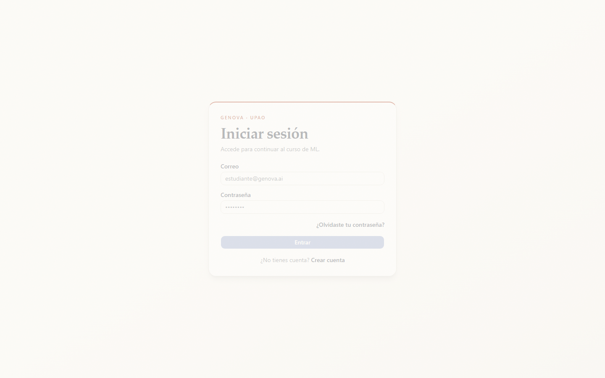 |
| 2 — Credenciales inválidas | 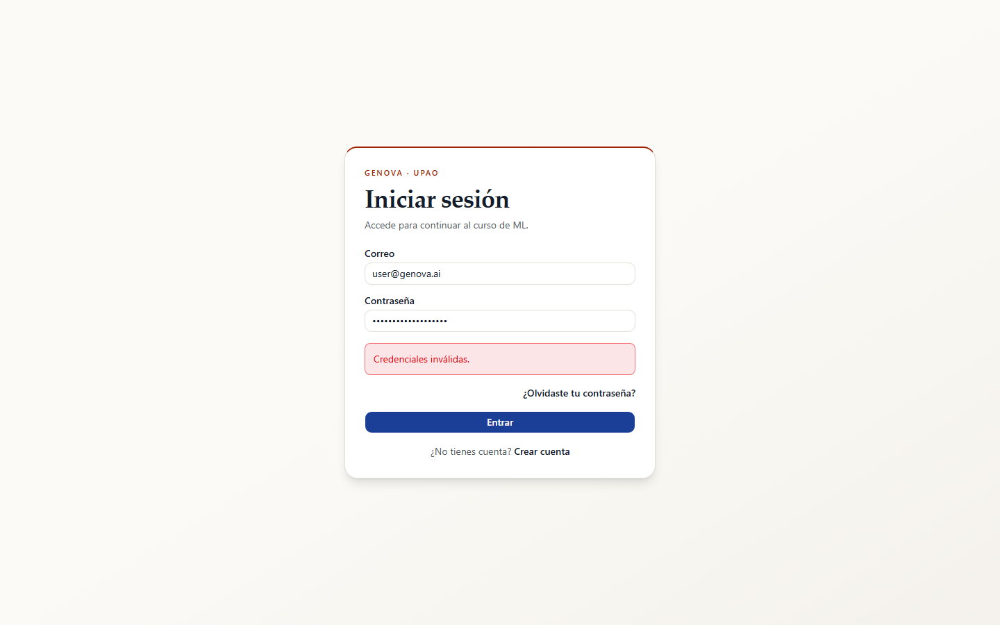 |
| 3 — Cuenta bloqueada | 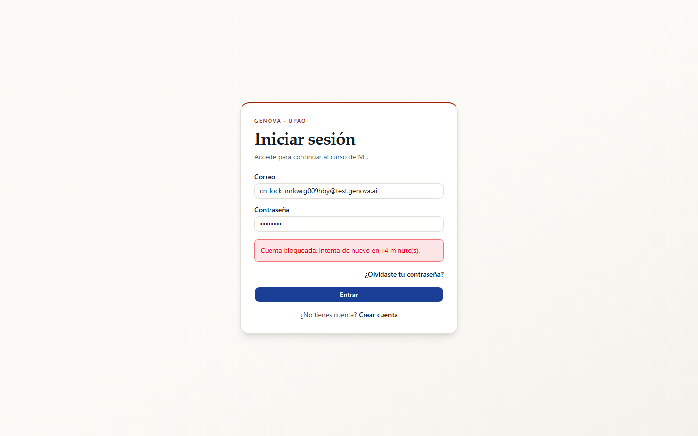 |
| 4 — Login correcto (dashboard) | 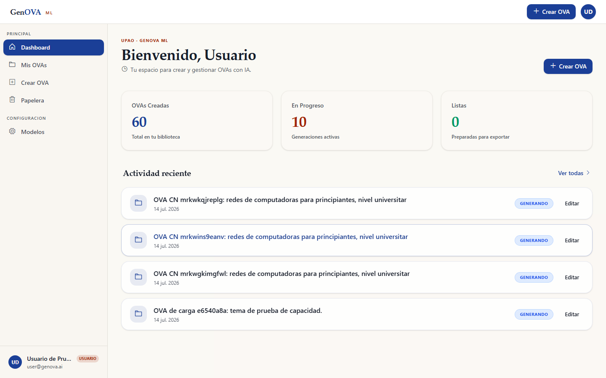 |

**Hardware y Software.** Navegador de escritorio sobre Windows 11.

**Procedimientos o herramientas necesarios.** Ir al módulo de inicio de sesión,
ingresar los datos según la condición, pulsar "Entrar" y observar la respuesta y
la secuencia de mensajes.

**Dependencias o relación con otros casos de prueba.** Requiere una cuenta
registrada (Escenario 1). La autenticación válida habilita todos los escenarios
protegidos (3 a 8).

---

## Escenario 3: Creación de un OVA desde un prompt (modelo 5E)

**Datos de Entrada.** Generación de un Objeto Virtual de Aprendizaje a partir de
un prompt y una configuración de recursos por fase pedagógica.

**Entorno.** Módulo de creación (`/crear`), con un área de texto para el prompt y
un modal de configuración de recursos organizados en las cinco fases del modelo
5E (Engage, Explore, Explain, Elaborate, Evaluate).

**Parámetros.**

- Área de texto del prompt (`textarea`)
- Botón "Configurar recursos 5E" (modal de recursos por fase)
- Botón "Generar OVA"

**Respuesta de otros módulos.** Se llama al motor de generación Prometheus
([`backend/prometheus/`](https://github.com/GenOVA-UPAO/GenOVA/tree/develop/backend/prometheus))
mediante el encolado de un job
([`backend/generation/jobs/`](https://github.com/GenOVA-UPAO/GenOVA/tree/develop/backend/generation/jobs));
al completar redirige al workspace del OVA.

**Condiciones iniciales.**

1. Se accedió a `/crear` sin escribir prompt ni configurar recursos.
2. Se escribió un prompt válido en el área de texto.
3. Se abrió el modal de configuración de recursos 5E.
4. Se generó el OVA y se abrió el resultado en el workspace.

**Datos de Salida — Resultados entregados.**

Para la **condición 1**, el botón "Generar OVA" permanece **deshabilitado**.
Para la **condición 2**, al escribir un prompt válido el botón se **habilita**.
Para la **condición 3**, la aplicación **muestra** el modal con las cinco fases
5E y los tipos de recurso seleccionables. Para la **condición 4**, la generación
produce el OVA y la aplicación **redirige** al workspace, donde se visualizan los
recursos generados por fase.

**Estado final de las variables.** Se adjuntan capturas de las pruebas:

| Condición | Captura |
|---|---|
| 1 — Botón Generar deshabilitado | 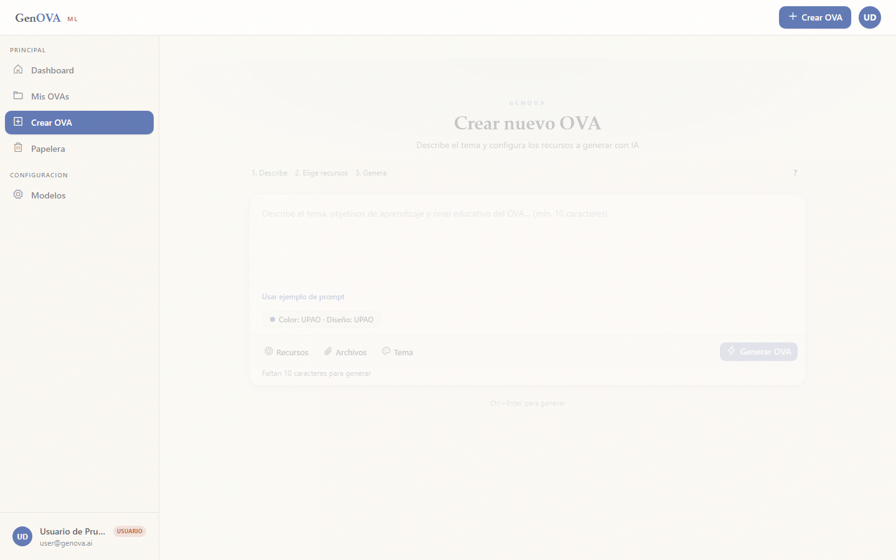 |
| 2 — Prompt escrito, botón habilitado | 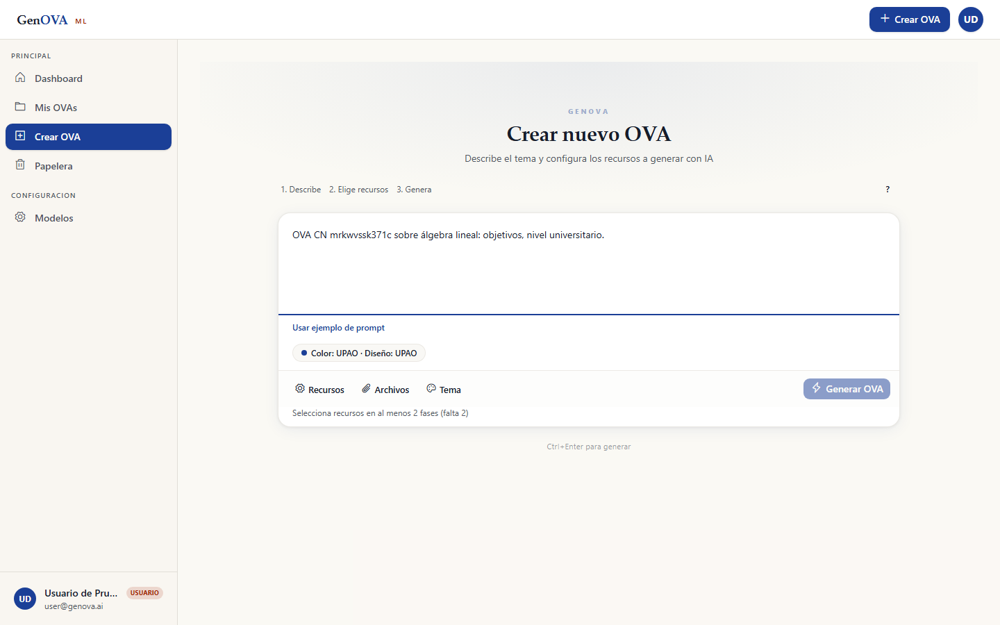 |
| 3 — Modal de recursos 5E | 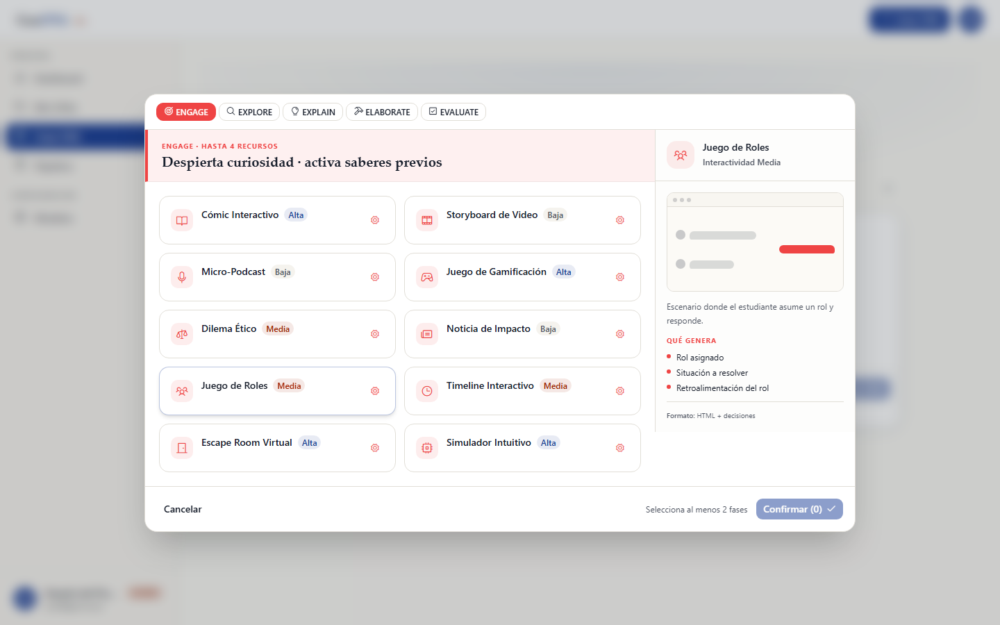 |
| 4 — OVA en el workspace | 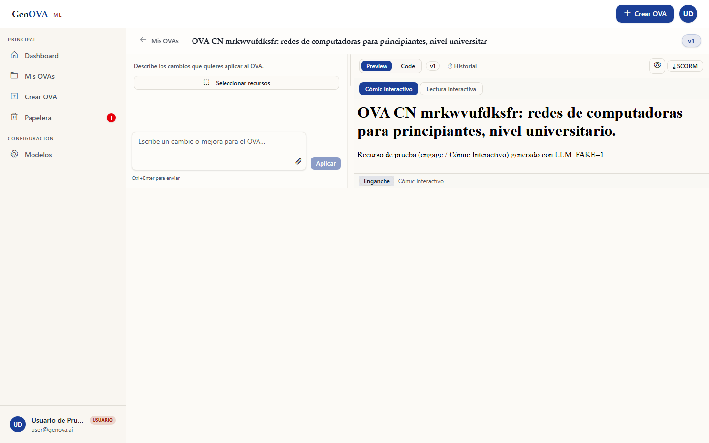 |

**Hardware y Software.** Navegador de escritorio; backend con `LLM_FAKE=1` para
generar HTML determinista en segundos (sin costo ni latencia de proveedores).

**Procedimientos o herramientas necesarios.** Autenticarse como usuario, ir a
`/crear`, escribir el prompt, configurar recursos en al menos dos fases y pulsar
"Generar OVA".

**Dependencias o relación con otros casos de prueba.** Requiere sesión iniciada
(Escenario 2). Produce el artefacto usado por los Escenarios 4, 5 y 6.

---

## Escenario 4: Visualización del OVA en el workspace (modelo 5E)

**Datos de Entrada.** Apertura y visualización de un OVA generado en el
workspace.

**Entorno.** Módulo workspace (`/workspace/:id`), con el visor de fases 5E y la
vista previa HTML de cada recurso.

**Parámetros.**

- Árbol/pestañas de fases 5E
- Recursos generados por fase (p. ej. "Cómic Interactivo", "Lectura Interactiva")
- Botón de exportación "SCORM"

**Respuesta de otros módulos.** Se llama al servicio de OVAs
([`backend/ova/`](https://github.com/GenOVA-UPAO/GenOVA/tree/develop/backend/ova))
que devuelve el OVA con sus fases y recursos.

**Condiciones iniciales.**

1. Se abrió un OVA existente desde su card ("Editar").
2. Se revisaron los recursos de las fases seleccionadas.

**Datos de Salida — Resultados entregados.**

Para la **condición 1**, la aplicación **carga** el workspace con el título del
OVA. Para la **condición 2**, el workspace **muestra** los recursos generados de
las fases seleccionadas y expone el botón "SCORM" para la exportación.

**Estado final de las variables.** Se adjuntan capturas de las pruebas:

| Condición | Captura |
|---|---|
| 1 — Workspace con recursos 5E | 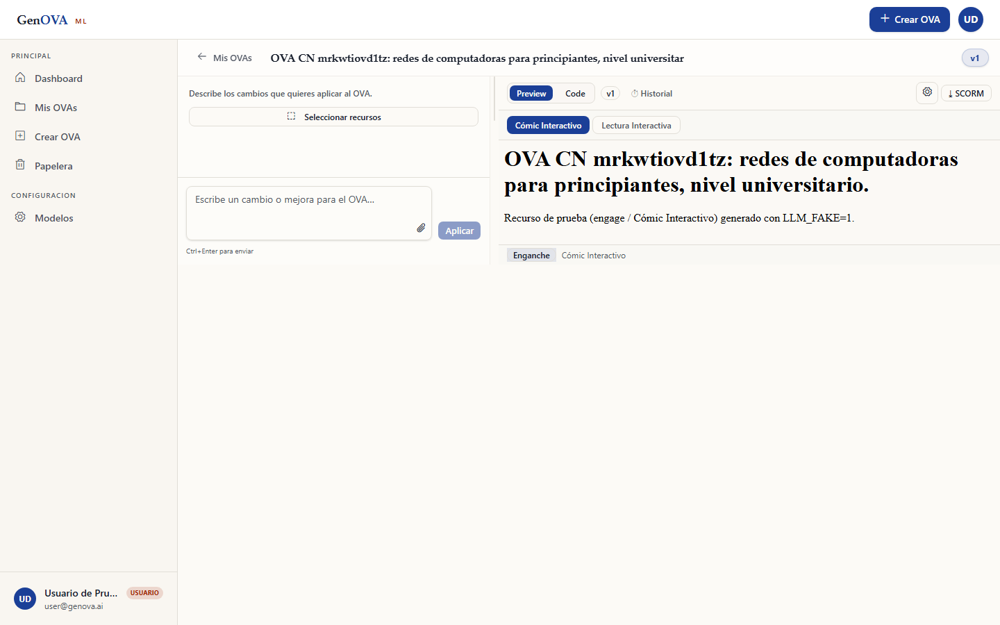 |
| 2 — Botón SCORM visible |  |

**Hardware y Software.** Navegador de escritorio sobre Windows 11.

**Procedimientos o herramientas necesarios.** Abrir un OVA desde Mis OVAs con
"Editar" y navegar por las fases 5E.

**Dependencias o relación con otros casos de prueba.** Requiere un OVA generado
(Escenario 3). Habilita la exportación (Escenario 5).

---

## Escenario 5: Exportación del OVA como paquete SCORM

**Datos de Entrada.** Descarga del OVA empaquetado en el estándar SCORM.

**Entorno.** Card del OVA en Mis OVAs (botón "Descargar") o botón "SCORM" del
workspace.

**Parámetros.**

- Botón "Descargar" / "SCORM"

**Respuesta de otros módulos.** Se llama al motor de exportación SCORM
([`backend/scorm/service.py`](https://github.com/GenOVA-UPAO/GenOVA/blob/develop/backend/scorm/service.py)),
que produce un ZIP con `imsmanifest.xml` (SCORM 1.2, con capa cmi5/xAPI
embebida).

**Condiciones iniciales.**

1. Se localizó un OVA en estado "Listo" en Mis OVAs.
2. Se pulsó "Descargar" en la card.

**Datos de Salida — Resultados entregados.**

Para la **condición 1**, la card **muestra** el botón "Descargar" habilitado.
Para la **condición 2**, la aplicación **genera y descarga** un archivo `.zip`
(paquete SCORM), verificable por su extensión y su manifiesto.

**Estado final de las variables.** Se adjuntan capturas de las pruebas:

| Condición | Captura |
|---|---|
| 1 — Card con botón Descargar | 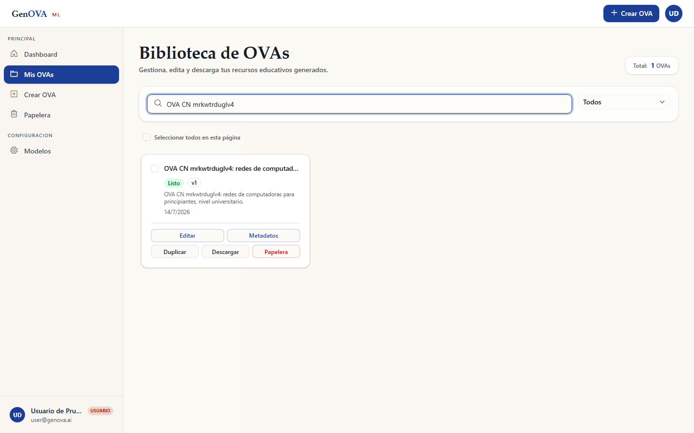 |
| 2 — Descarga del paquete SCORM | 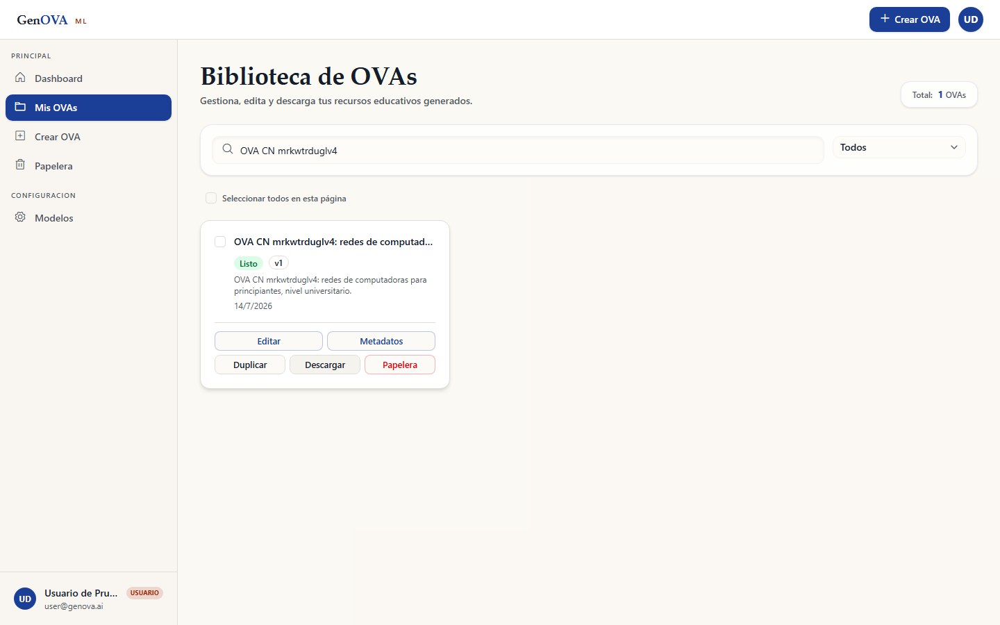 |

**Hardware y Software.** Navegador de escritorio sobre Windows 11.

**Procedimientos o herramientas necesarios.** Localizar un OVA "Listo", pulsar
"Descargar" y verificar el `.zip` descargado (opcionalmente validarlo en SCORM
Cloud / validador ADL).

**Dependencias o relación con otros casos de prueba.** Requiere un OVA generado
(Escenario 3).

---

## Escenario 6: Gestión de la biblioteca (buscar, duplicar, papelera)

**Datos de Entrada.** Operaciones de gestión sobre los OVAs de la biblioteca del
usuario.

**Entorno.** Módulo Mis OVAs (`/mis-ovas`) y Papelera (`/papelera`), con
buscador, y acciones por card (Duplicar, Papelera, Restaurar, Borrar
definitivamente).

**Parámetros.**

- Buscador por título
- Botones de card: "Duplicar", "Papelera"
- Confirmación "Mover" (papelera)

**Respuesta de otros módulos.** Se llama al servicio de OVAs para duplicar,
mover a papelera (borrado lógico) y listar.

**Condiciones iniciales.**

1. Se buscó un OVA por su título.
2. Se duplicó el OVA desde su card.
3. Se movió el OVA a la papelera y se confirmó "Mover".

**Datos de Salida — Resultados entregados.**

Para la **condición 1**, el buscador **filtra** y muestra la card del OVA. Para
la **condición 2**, la aplicación **crea** una copia con el sufijo "(copia)".
Para la **condición 3**, el OVA **desaparece** de Mis OVAs y **aparece** en la
papelera.

**Estado final de las variables.** Se adjuntan capturas de las pruebas:

| Condición | Captura |
|---|---|
| 1 — Búsqueda por título |  |
| 2 — Duplicado "(copia)" | 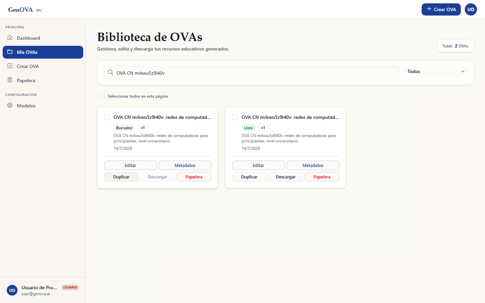 |
| 3 — Confirmación mover a papelera | 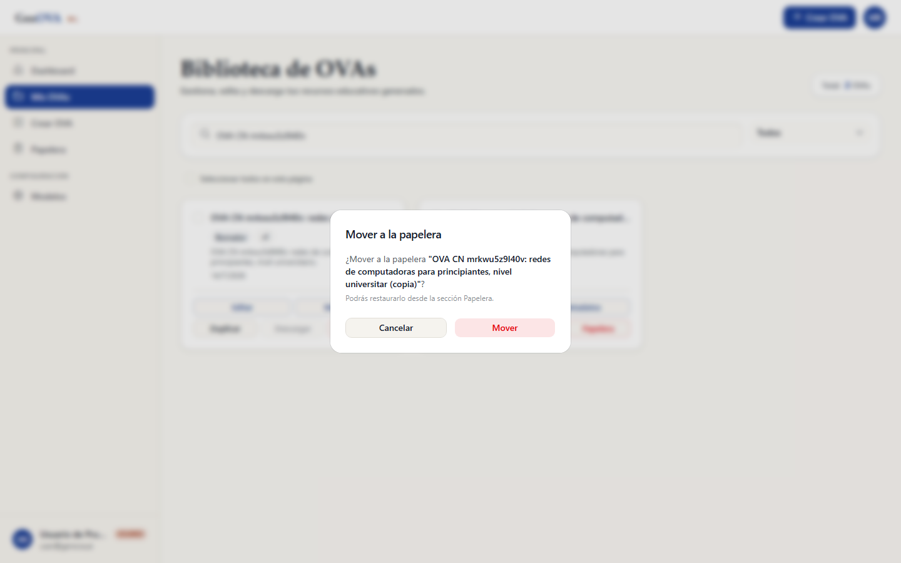 |
| 3 — OVA en la papelera | 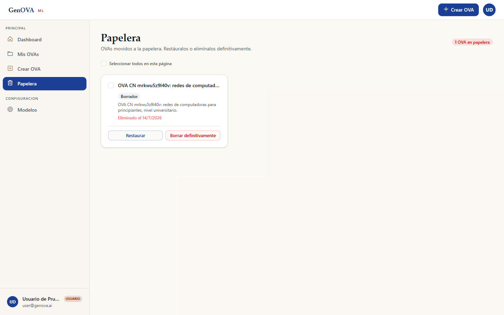 |

**Hardware y Software.** Navegador de escritorio sobre Windows 11.

**Procedimientos o herramientas necesarios.** En Mis OVAs, usar el buscador y las
acciones de card; verificar el estado en `/papelera`.

**Dependencias o relación con otros casos de prueba.** Requiere OVAs generados
(Escenario 3).

---

## Escenario 7: Edición de perfil del usuario

**Datos de Entrada.** Visualización y edición de los datos de perfil del usuario.

**Entorno.** Módulo perfil (`/profile`), con los datos de la cuenta y el cambio
de contraseña.

**Parámetros.**

- Datos de la cuenta (nombre, email, rol)
- Cambio de contraseña (contraseña actual, nueva, confirmación)

**Respuesta de otros módulos.** Se llama al servicio de usuarios
([`backend/users/`](https://github.com/GenOVA-UPAO/GenOVA/tree/develop/backend/users))
para leer y actualizar el perfil.

**Condiciones iniciales.**

1. Se navegó a `/profile` con una cuenta autenticada.
2. (Validación) Cambio de contraseña con una nueva contraseña débil o con
   confirmación que no coincide.

**Datos de Salida — Resultados entregados.**

Para la **condición 1**, la aplicación **muestra** los datos de la cuenta. Para
la **condición 2**, la aplicación **rechaza** el cambio y **muestra** el error de
política de contraseña o de no coincidencia (misma política que el registro:
mínimo 8 caracteres con letras y números).

**Estado final de las variables.** Se adjuntan capturas de las pruebas:

| Condición | Captura |
|---|---|
| 1 — Pantalla de perfil | 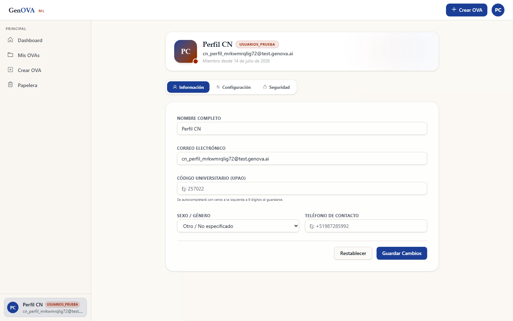 |

**Hardware y Software.** Navegador de escritorio sobre Windows 11.

**Procedimientos o herramientas necesarios.** Autenticarse, ir a `/profile`,
editar los datos y/o cambiar la contraseña.

**Dependencias o relación con otros casos de prueba.** Requiere sesión iniciada
(Escenario 2).

---

## Escenario 8: Administración (roles, usuarios y modelos LLM)

**Datos de Entrada.** Gestión administrativa de roles, usuarios y del catálogo de
modelos de IA.

**Entorno.** Panel de administración: gestión de usuarios (`/admin`), gestión de
roles (`/admin/roles`) y configuración de modelos LLM (`/models`). Todas
protegidas por el `adminGuard`.

**Parámetros.**

- Buscador de usuarios por nombre/email
- Acciones de rol: "Nuevo rol", "Editar permisos", "Guardar cambios", "Eliminar rol"
- Catálogo de proveedores y modelos LLM

**Respuesta de otros módulos.** Se llama a los servicios de roles y usuarios
([`backend/roles/`](https://github.com/GenOVA-UPAO/GenOVA/tree/develop/backend/roles),
[`backend/users/`](https://github.com/GenOVA-UPAO/GenOVA/tree/develop/backend/users))
y al catálogo de modelos
([`backend/llm/`](https://github.com/GenOVA-UPAO/GenOVA/tree/develop/backend/llm)).

**Condiciones iniciales.**

1. Como administrador, se accedió a la gestión de usuarios y se buscó por email.
2. Se accedió a la gestión de roles del sistema.
3. Se abrió el formulario de creación de rol.
4. Se accedió a la configuración del catálogo de modelos LLM.
5. (Control de acceso) Un usuario sin rol de administrador intentó acceder a `/admin`.

**Datos de Salida — Resultados entregados.**

Para la **condición 1**, la aplicación **muestra** la lista de usuarios filtrada.
Para la **condición 2**, **muestra** los roles del sistema con su etiqueta. Para
la **condición 3**, **muestra** el formulario de creación de rol. Para la
**condición 4**, **muestra** el catálogo de proveedores y modelos asignables por
tarea. Para la **condición 5**, el `adminGuard` **bloquea** el acceso y no
muestra el panel de administración.

**Estado final de las variables.** Se adjuntan capturas de las pruebas:

| Condición | Captura |
|---|---|
| 1 — Gestión de usuarios | 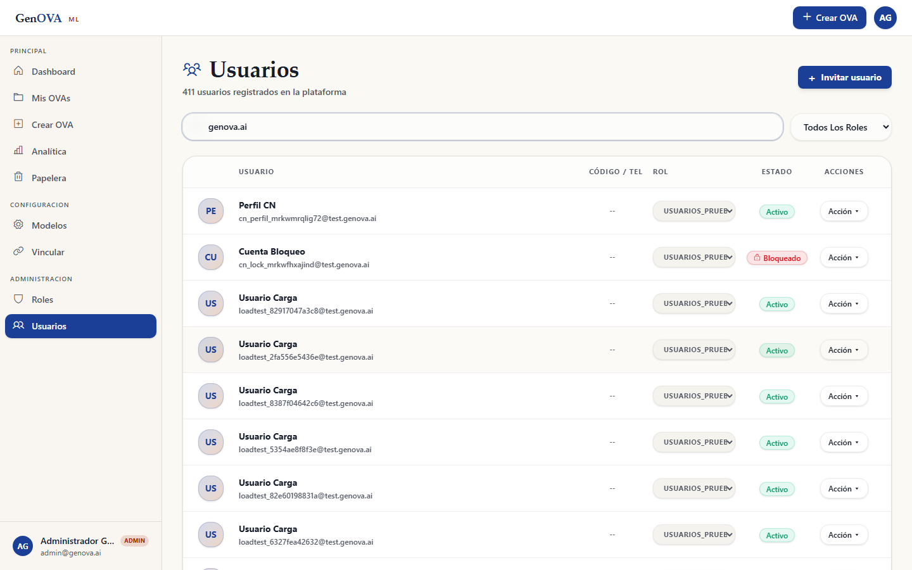 |
| 2 — Gestión de roles | 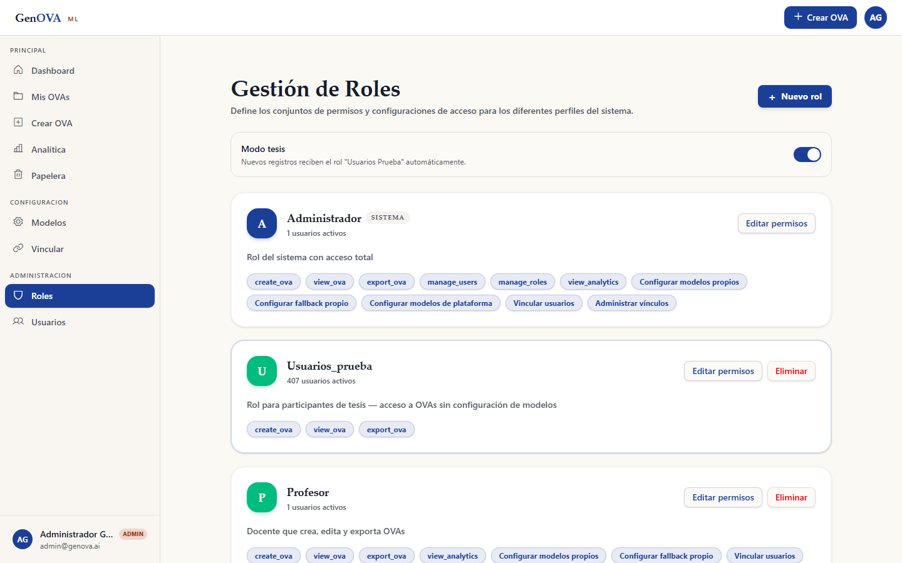 |
| 3 — Creación de rol | 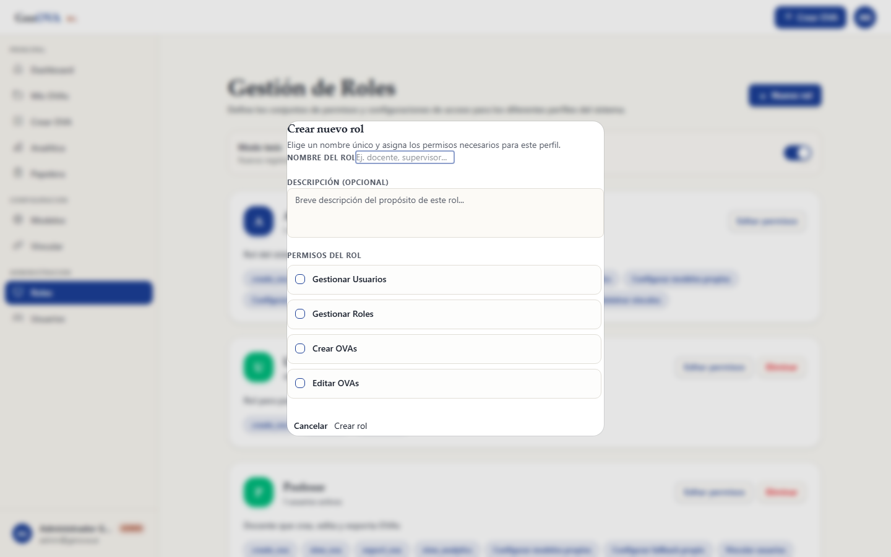 |
| 4 — Configuración de modelos LLM | 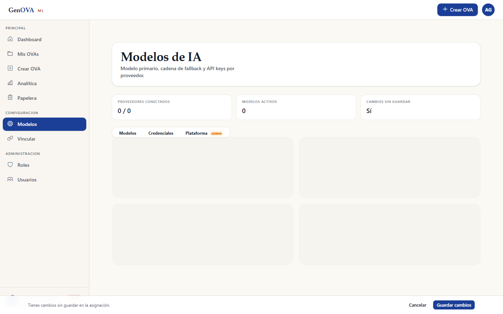 |

**Hardware y Software.** Navegador de escritorio sobre Windows 11.

**Procedimientos o herramientas necesarios.** Autenticarse como administrador
(`admin@genova.ai`), navegar a `/admin`, `/admin/roles` y `/models`.

**Dependencias o relación con otros casos de prueba.** Requiere sesión con rol
"administrador". El control de acceso (condición 5) se relaciona con el
Escenario 2 (autenticación por rol).

---

## Listado técnico

### Archivos involucrados

- Frontend (Angular 22): rutas y páginas de `frontend/src/features/` (auth,
  ova-workspace, ova-library, profile, admin, llm-settings) y el layout de
  `frontend/src/app/layout/`.
- Backend (FastAPI): módulos `auth/`, `ova/`, `roles/`, `users/`, `scorm/`,
  `prometheus/`, `generation/jobs/`, `llm/` y `rag/` bajo
  [`backend/`](https://github.com/GenOVA-UPAO/GenOVA/tree/develop/backend).
- Script de captura de caja negra:
  [`tests/capture-caja-negra.mjs`](https://github.com/GenOVA-UPAO/GenOVA/blob/develop/tests/capture-caja-negra.mjs).

### Sistemas y bibliotecas

- Frontend: Angular 22, Angular Router, Tailwind CSS 4, SpartanUI.
- Backend: FastAPI, SQLAlchemy 2, Uvicorn, SlowAPI, arq (colas), Redis
  (opcional), bcrypt, PyJWT.
- IA/RAG: Groq, OpenRouter, Gemini embeddings, pgvector.
- Empaquetado: SCORM 1.2 + cmi5/xAPI.
- Pruebas: Playwright (Chromium), Cucumber / playwright-bdd.

### Errores y observaciones detectadas

- En el bloqueo por intentos (Escenario 2), el 5.º intento fallido bloquea la
  cuenta pero aún devuelve el mensaje genérico "Credenciales inválidas."; el
  mensaje explícito de bloqueo ("Cuenta bloqueada. Intenta de nuevo en N
  minuto(s).") recién aparece en el 6.º intento. Es coherente con la lógica del
  backend, aunque el usuario no percibe el bloqueo hasta un intento después.
- El subtítulo de la pantalla de login muestra un texto de contexto heredado
  ("Accede para continuar al curso de ML."), que conviene revisar para
  neutralizarlo respecto al dominio.

### Notas

- Las pruebas se ejecutaron con `LLM_FAKE=1` para obtener recursos deterministas
  sin costo de proveedores; el flujo de generación real usa el motor Prometheus
  (work-pool) con los proveedores configurados en `/models`.
- Las capturas viven en
  [`docs/assets/caja-negra/`](https://github.com/GenOVA-UPAO/GenOVA/tree/develop/docs/assets/caja-negra).
