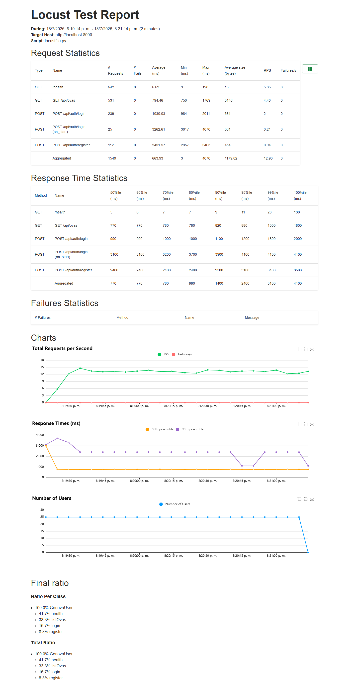
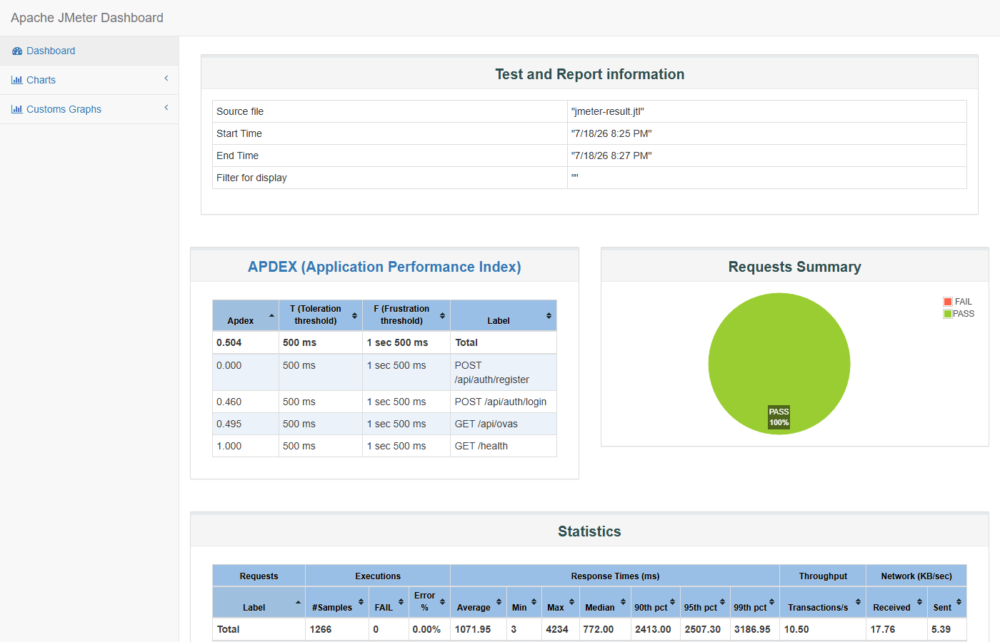
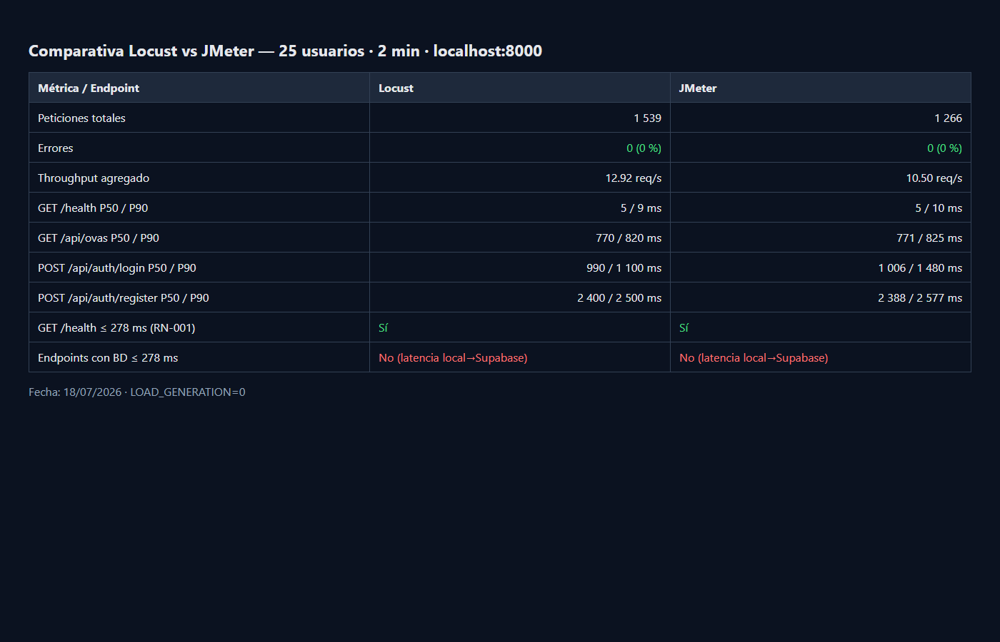

# Reporte de Pruebas de Carga — GenOVA

> Pruebas de **capacidad / carga** del backend FastAPI bajo usuarios concurrentes,
> con dos herramientas equivalentes (**Locust** y **Apache JMeter**) y la misma
> configuración de escenario, para comparar latencias (P50/P90/P99), throughput y
> tasa de errores frente al umbral formal **RN-001: P90 ≤ 278 ms** en endpoints
> que no son de generación LLM.

| Campo | Valor |
|---|---|
| **Proyecto** | GenOVA — generación asistida por IA de OVAs (SCORM 1.2 / 5E) |
| **Tipo de prueba** | Carga / rendimiento HTTP (backend) |
| **Herramientas** | Locust 2.34 · Apache JMeter 5.6.3 |
| **Fecha de ejecución** | 18/07/2026 |
| **Ejecutado por** | Jeffry A. Romero Uriol |
| **Escenario** | 25 usuarios · ramp-up 5/s · 2 min · think time 0.5–2 s |
| **Resultado disponibilidad** | **Locust 0 % errores · JMeter 0 % errores** ✔ |

---

## 1. Introducción y objetivo

Validar el comportamiento del API bajo carga concurrente típica de uso
(salud, biblioteca de OVAs, login y registro), midiendo percentiles de latencia
y comparando dos implementaciones del mismo plan. El gate formal RN-001 aplica a
endpoints **no-LLM**; el encolado de generación quedó **desactivado**
(`LOAD_GENERATION=0` / `loadGeneration=false`) para aislar latencia HTTP.

## 2. Herramientas y enfoque

- **Locust** (`tests/load/locustfile.py`) — usuarios virtuales en Python; CSV + HTML.
- **Validador** `tests/load/check_thresholds.py` — falla si P90 no-LLM > 278 ms o
  fallos > 1 %.
- **JMeter** (`tests/load/genova-loadtest.jmx`) — Thread Group equivalente;
  Aggregate Report + dashboard HTML.
- **Cookie Secure sobre HTTP local:** con `COOKIE_SAMESITE=none` el backend emite
  `genova_token` con `Secure`. Locust/requests y el Cookie Manager de JMeter no
  reenvían esa cookie en `http://localhost`. Se reinyecta el token tras el login
  (helper en Locust; RegexExtractor + header `Cookie` en JMeter) **solo en el
  harness de carga**, sin cambiar la política de cookies de producción.

## 3. Entorno de ejecución

| Componente | Detalle |
|---|---|
| Backend | FastAPI en `http://localhost:8000` |
| Base de datos | Supabase PostgreSQL (región `aws-1-us-east-1`) |
| Rate limit | Desactivado en el backend de prueba |
| Generación LLM | No ejercitada en esta corrida (`LOAD_GENERATION=0`) |
| Cliente de carga | Máquina local Windows 11 (Perú) → red pública → Supabase US-East |
| Cuentas seed | `user@genova.ai` (login autenticado) |

## 4. Escenario de carga y pesos

| Peso (Locust) | Petición | Notas |
|---|---|---|
| 5 | `GET /health` | sin BD |
| 4 | `GET /api/ovas?page=1` | con BD + cookie de sesión |
| 2 | `POST /api/auth/login` | con BD (Locust; JMeter solo Once Only al inicio) |
| 1 | `POST /api/auth/register` | con BD, email único |
| — | `POST /api/ova/jobs` | deshabilitado en esta ejecución |

Parámetros comunes: **25** usuarios, ramp-up **5** s, duración **120** s,
think time **0.5–2.0** s.

## 5. Resultados — Locust

| Endpoint | # reqs | Fallos | P50 (ms) | P90 (ms) | P99 (ms) | ¿P90 ≤ 278 ms? |
|---|---:|---:|---:|---:|---:|:--:|
| `GET /health` | 638 | 0 | 5 | 9 | 26 | ✔ Sí |
| `GET /api/ovas` | 525 | 0 | 770 | 820 | 1 500 | ✖ No |
| `POST /api/auth/login` | 239 | 0 | 990 | 1 100 | 1 800 | ✖ No |
| `POST /api/auth/login (on_start)` | 25 | 0 | 3 100 | 3 900 | 4 100 | ✖ No |
| `POST /api/auth/register` | 112 | 0 | 2 400 | 2 500 | 3 400 | ✖ No |
| **Agregado** | **1 539** | **0 (0 %)** | 770 | 1 400 | 3 100 | — |

- Throughput agregado: **≈ 12.92 req/s**.
- `check_thresholds.py`: incumple RN-001 en endpoints con BD (esperado en este entorno; ver §7).

## 6. Resultados — Apache JMeter

Valores de *90% Line* = `pct1ResTime` del dashboard (percentil 90 por defecto).

| Endpoint | # samples | Fallos | Mediana (ms) | P90 (ms) | P99 (ms) | ¿P90 ≤ 278 ms? |
|---|---:|---:|---:|---:|---:|:--:|
| `GET /health` | 421 | 0 | 5 | 10 | 26 | ✔ Sí |
| `GET /api/ovas` | 415 | 0 | 771 | 825 | 1 481 | ✖ No |
| `POST /api/auth/login` (Once Only) | 25 | 0 | 1 006 | 1 480 | 1 976 | ✖ No |
| `POST /api/auth/register` | 405 | 0 | 2 388 | 2 577 | 3 513 | ✖ No |
| **Total** | **1 266** | **0 (0 %)** | 772 | 2 413 | 3 187 | — |

- Throughput agregado: **≈ 10.50 req/s**.
- Dashboard HTML: `tests/load/jmeter-report/`.

## 7. Comparación Locust vs JMeter

Misma máquina, mismo host (`localhost:8000`), mismos usuarios/duración/think time.

| Métrica | Locust | JMeter |
|---|---|---|
| Peticiones totales | 1 539 | 1 266 |
| Errores | 0 % | 0 % |
| Throughput | 12.92 req/s | 10.50 req/s |
| `/health` P90 | 9 ms | 10 ms |
| `/api/ovas` P90 | 820 ms | 825 ms |
| `/login` P90 | 1 100 ms | 1 480 ms |
| `/register` P90 | 2 500 ms | 2 577 ms |

**Interpretación:** ambas herramientas coinciden en disponibilidad al 100 % y en el
orden de magnitud de latencias. Las diferencias de throughput y de P90 en login
se explican por el mix de tareas (Locust vuelve a llamar login con peso 2; JMeter
solo hace login una vez por hilo) y por jitter de red hacia Supabase.

## 8. Varianzas / limitaciones del entorno (IEEE)

La disponibilidad fue del **100 %** y `/health` (sin BD) cumple RN-001 con holgura
(P90 ≈ 9–10 ms). Los endpoints con base de datos superan 278 ms por un **sesgo de
entorno**, no necesariamente por un defecto de la aplicación en producción: la
`DATABASE_URL` apunta a Supabase en US-East y la carga se genera desde una
máquina en Perú (RTT de red pública en cada consulta). En despliegue cloud-a-cloud
(p. ej. Railway junto a la BD) ese salto no existe. Además, con 25 usuarios el
pool (`DB_POOL_SIZE` + overflow) puede saturar parcialmente.

## 9. Evidencia visual








## 10. Cómo reproducir

```bash
# Backend en :8000 (RATE_LIMIT_ENABLED=0; sin LLM en esta corrida)
pip install -r tests/load/requirements.txt
set LOAD_GENERATION=0
locust -f tests/load/locustfile.py --headless -u 25 -r 5 -t 2m ^
  --host http://localhost:8000 --csv tests/load/report --html tests/load/report.html
python tests/load/check_thresholds.py tests/load/report_stats.csv

# JMeter 5.6.3+
jmeter -n -t tests/load/genova-loadtest.jmx -l tests/load/jmeter-result.jtl ^
  -e -o tests/load/jmeter-report -Jhost=localhost -Jport=8000
```

- Locust: [`tests/load/locustfile.py`](../../tests/load/locustfile.py)
- JMeter: [`tests/load/genova-loadtest.jmx`](../../tests/load/genova-loadtest.jmx)
- Assets: [`docs/assets/carga/`](../assets/carga/)

## 11. Ajustes del harness durante la ejecución

1. Reinyección de `genova_token` en Locust y JMeter para HTTP local con cookie
   `Secure` (ver §2) — sin cambio de código de producto.
2. `check_thresholds.py`: sustitución de emojis en mensajes de consola para evitar
   `UnicodeEncodeError` en Windows (cp1252).
