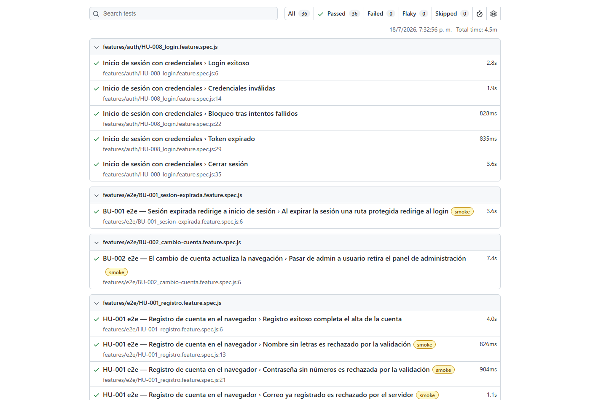
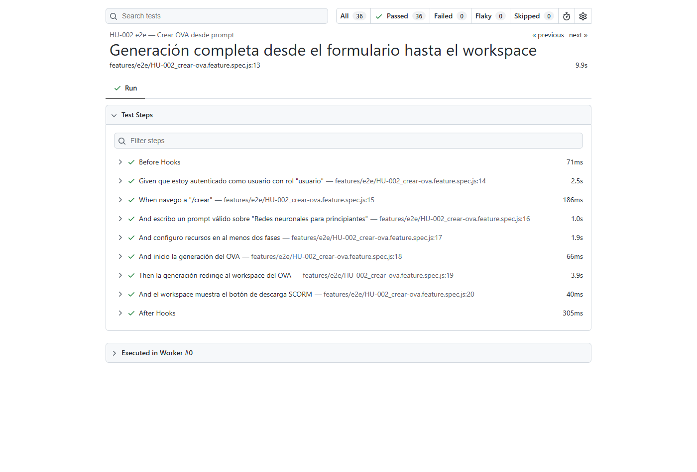

# Reporte de Pruebas End-to-End (E2E) — GenOVA

> Pruebas automatizadas que ejercitan **flujos completos sobre las rutas
> funcionales de la interfaz gráfica** en un navegador real (extremo a extremo:
> navegador → frontend Angular → backend FastAPI → base de datos), tal como lo
> haría un usuario. Escritas en **Gherkin** (BDD) y ejecutadas con **Playwright**.

| Campo | Valor |
|---|---|
| **Proyecto** | GenOVA — generación asistida por IA de OVAs (SCORM 1.2 / 5E) |
| **Tipo de prueba** | End-to-End (E2E) funcional de la interfaz gráfica |
| **Herramienta** | Playwright (Chromium) + Playwright-BDD (Cucumber/Gherkin) |
| **Fecha de ejecución** | 18/07/2026 |
| **Ejecutado por** | Jeffry A. Romero Uriol *(editar si aplica)* |
| **Suite** | 16 features · **36 escenarios** |
| **Resultado** | **36 / 36 PASA** ✔ |

---

## 1. Introducción y objetivo

Las pruebas **End-to-End (E2E)** validan que la aplicación funciona correctamente
**de extremo a extremo**: se automatiza un navegador real que recorre las rutas
de la interfaz (login, registro, creación de OVA, workspace, biblioteca, perfil,
administración), interactúa con los componentes reales (formularios, modales,
botones) y verifica las respuestas de la aplicación contra el backend y la base
de datos vivos. A diferencia de las pruebas unitarias (que aíslan piezas), las
E2E prueban el **sistema integrado** desde la perspectiva del usuario.

Se siguió la recomendación de usar herramientas de grabación/automatización de
rutas (Selenium/Playwright); se adoptó **Playwright** por su integración nativa
con **BDD (Gherkin)**, trazas, videos y reporte HTML.

## 2. Herramientas y enfoque

- **Playwright** (motor Chromium) automatiza el navegador.
- **playwright-bdd** traduce los archivos `.feature` (Gherkin: `Dado/Cuando/Entonces`)
  a pruebas ejecutables; los *steps* viven en `tests/steps/e2e/`.
- Cada escenario ejercita **selectores reales** de la UI (los mismos que la app).
- **Evidencia automática:** reporte HTML y **grabación en vídeo de todos los
  escenarios** (`video: 'on'`), más *screenshot* y *trace* retenidos ante fallo.
  En CI el vídeo vuelve a `retain-on-failure` para no inflar los artefactos.
  Las grabaciones de la última corrida están indexadas en la sección 10.
- **Tags `@smoke`:** escenarios seguros que **no crean datos** (solo validaciones
  y navegación) — aptos para correr incluso contra el entorno de despliegue.
- **Comando:** `pnpm --filter genova-tests test:e2e`
  (`bddgen` genera los specs y luego `playwright test` los ejecuta).

## 3. Entorno de ejecución

| Componente | Detalle |
|---|---|
| Frontend | Angular 22 servido en `http://localhost:4200` |
| Backend | FastAPI (`uvicorn`) en `http://localhost:8000`, con `LLM_FAKE=1` (generación 5E determinista sin proveedores) y `RATE_LIMIT_ENABLED=0` (igual que en CI) |
| Worker | `arq` (cola durable) con `LLM_FAKE=1` — procesa la generación en segundos |
| Base de datos | Supabase PostgreSQL + pgvector |
| Navegador | Chromium (Playwright), 1 worker, timeout 180 s/prueba |
| Reporte | HTML de Playwright en `tests/playwright-report/` |
| Sistema operativo | Windows 11 |
| Cuentas seed | `admin@genova.ai` (Administrador) · `user@genova.ai` (Usuario) |

> **Nota sobre `LLM_FAKE=1`:** la suite E2E prueba las **rutas y flujos** de la
> interfaz, no la calidad del contenido generado por los LLM; por eso la
> generación se ejecuta en modo determinista (como en CI), lo que hace las
> pruebas rápidas y repetibles.

## 4. Estrategia y cobertura

Cobertura por **rutas funcionales** de la interfaz gráfica:

| Ruta | Cubierta por |
|---|---|
| `/login` | HU-008, HU-010, BU-001 |
| `/register` | HU-001 |
| `/dashboard` | HU-010, BU-002, HU-018 |
| `/crear` | HU-002, HU-010 |
| `/workspace/:id` | HU-002, HU-025 |
| `/mis-ovas` | HU-004, HU-006, HU-012, HU-013, HU-025 |
| `/papelera` | HU-012 |
| `/profile` | HU-015 |
| `/admin` (usuarios) | HU-021, HU-018 |
| `/admin/roles` | HU-018, HU-019, HU-020 |

Cada feature traza a su **Historia de Usuario (HU)** o **Bug (BU)** del backlog.

## 5. Matriz de casos E2E (resumen)

| Feature | HU/BU | Área / Rutas | Escenarios | Resultado |
|---|---|---|:--:|:--:|
| Inicio de sesión | HU-008 | Autenticación · `/login` | 5 | ✔ PASA |
| Registro de cuenta | HU-001 | Autenticación · `/register` | 4 | ✔ PASA |
| Sesión expirada redirige a login | BU-001 | Autenticación · rutas protegidas | 1 | ✔ PASA |
| Cambio de cuenta actualiza navegación | BU-002 | Navegación · `/dashboard` | 1 | ✔ PASA |
| Layout y navegación principal | HU-010 | Layout · `/login`, `/dashboard`, `/crear` | 2 | ✔ PASA |
| Crear OVA desde prompt | HU-002 | Generación · `/crear` → `/workspace` | 2 | ✔ PASA |
| Exportar OVA como SCORM | HU-004 | SCORM · `/mis-ovas` | 2 | ✔ PASA |
| Historial de OVAs (Mis OVAs) | HU-006 | Biblioteca · `/mis-ovas` | 2 | ✔ PASA |
| Eliminar OVA con papelera | HU-012 | Biblioteca · `/mis-ovas`, `/papelera` | 3 | ✔ PASA |
| Duplicar OVA existente | HU-013 | Biblioteca · `/mis-ovas` | 1 | ✔ PASA |
| Workspace de edición del OVA | HU-025 | Workspace · `/workspace/:id` | 2 | ✔ PASA |
| Ver perfil de usuario | HU-015 | Perfil · `/profile` | 1 | ✔ PASA |
| Gestión de Roles — Crear Rol | HU-018 | Admin · `/admin`, `/admin/roles` | 6 | ✔ PASA |
| Editar rol | HU-019 | Admin · `/admin/roles` | 2 | ✔ PASA |
| Eliminar rol | HU-020 | Admin · `/admin/roles` | 1 | ✔ PASA |
| Gestión de usuarios | HU-021 | Admin · `/admin` | 1 | ✔ PASA |
| **Total** | | | **36** | **36 / 36 ✔** |

---

## 6. Casos E2E detallados (Gherkin)

> Cada escenario se ejecutó en el navegador; todos los pasos `Entonces` se
> cumplieron (**PASA**). Formato: `Dado` (contexto) · `Cuando` (acción) ·
> `Entonces` (verificación).

### HU-008 — Inicio de sesión (`/login`) · 5/5 ✔

| Escenario | Gherkin (resumen) | Resultado |
|---|---|:--:|
| Login exitoso | Dado en /login · Cuando ingreso credenciales válidas y envío · Entonces recibo JWT (24 h) y me redirige al dashboard | ✔ |
| Credenciales inválidas | Cuando ingreso credenciales inválidas · Entonces error descriptivo y no accedo | ✔ |
| Bloqueo tras intentos | Dado 5 intentos fallidos · Cuando reintento · Entonces cuenta bloqueada 15 min + mensaje | ✔ |
| Token expirado | Dado token expirado · Cuando accedo a ruta protegida · Entonces redirige a login | ✔ |
| Cerrar sesión | Dado sesión activa · Cuando "Cerrar sesión" · Entonces token eliminado y redirige a login | ✔ |

### HU-001 — Registro de cuenta (`/register`) · 4/4 ✔

| Escenario | Gherkin (resumen) | Resultado |
|---|---|:--:|
| Registro exitoso | Cuando completo nombre + correo único + contraseña válida y envío · Entonces alta con aviso de verificación o sesión iniciada | ✔ |
| Nombre sin letras (@smoke) | Cuando nombre "..." · Entonces error "El nombre debe contener al menos una letra." | ✔ |
| Contraseña sin números (@smoke) | Cuando contraseña "solopalabras" · Entonces error "Mínimo 8 caracteres con letras y números." | ✔ |
| Correo ya registrado (@smoke) | Cuando correo "user@genova.ai" · Entonces error "El correo ya está registrado." | ✔ |

### BU-001 — Sesión expirada redirige a login · 1/1 ✔

| Escenario | Gherkin (resumen) | Resultado |
|---|---|:--:|
| Ruta protegida redirige (@smoke) | Dado sesión activa · Cuando expira y navego a "/mis-ovas" · Entonces me redirige al login | ✔ |

### BU-002 — Cambio de cuenta actualiza la navegación · 1/1 ✔

| Escenario | Gherkin (resumen) | Resultado |
|---|---|:--:|
| Admin → usuario retira panel admin (@smoke) | Dado admin en /dashboard (ve "Administración") · Cuando cambio a usuario · Entonces no veo el panel de administración | ✔ |

### HU-010 — Layout y navegación principal · 2/2 ✔

| Escenario | Gherkin (resumen) | Resultado |
|---|---|:--:|
| Login renderiza (@smoke) | Dado en /login · Entonces visualizo la pantalla de inicio de sesión | ✔ |
| Rutas protegidas comparten Navbar/Sidebar (@smoke) | Cuando navego a /dashboard y /crear · Entonces veo la navegación principal completa | ✔ |

### HU-002 — Crear OVA desde prompt (`/crear` → `/workspace`) · 2/2 ✔

| Escenario | Gherkin (resumen) | Resultado |
|---|---|:--:|
| Botón Generar deshabilitado sin prompt (@smoke) | Cuando navego a /crear · Entonces botón "Generar OVA" deshabilitado | ✔ |
| Generación completa hasta el workspace | Cuando escribo prompt, configuro recursos en ≥2 fases e inicio la generación · Entonces redirige al workspace y muestra el botón SCORM | ✔ |

### HU-004 — Exportar OVA como SCORM (`/mis-ovas`) · 2/2 ✔

| Escenario | Gherkin (resumen) | Resultado |
|---|---|:--:|
| Botón Descargar habilitado | Dado un OVA listo · Cuando lo localizo en Mis OVAs · Entonces "Descargar" habilitado | ✔ |
| Descarga entrega un zip | Cuando descargo desde su card · Entonces se descarga un archivo `.zip` | ✔ |

### HU-006 — Historial de OVAs (`/mis-ovas`) · 2/2 ✔

| Escenario | Gherkin (resumen) | Resultado |
|---|---|:--:|
| Búsqueda por título | Dado un OVA propio · Cuando busco su título · Entonces aparece en el listado | ✔ |
| Cuenta nueva ve estado vacío | Dado cuenta recién creada · Cuando navego a /mis-ovas · Entonces veo el estado vacío | ✔ |

### HU-012 — Eliminar OVA con papelera (`/mis-ovas`, `/papelera`) · 3/3 ✔

| Escenario | Gherkin (resumen) | Resultado |
|---|---|:--:|
| Mover a papelera y restaurar | Cuando muevo a papelera · Entonces sale de Mis OVAs y aparece en papelera · Cuando restauro · Entonces vuelve a Mis OVAs | ✔ |
| Borrar definitivamente | Cuando muevo a papelera y borro definitivamente · Entonces ya no aparece | ✔ |
| Cuenta nueva ve papelera vacía | Dado cuenta nueva · Cuando navego a /papelera · Entonces estado vacío | ✔ |

### HU-013 — Duplicar OVA existente (`/mis-ovas`) · 1/1 ✔

| Escenario | Gherkin (resumen) | Resultado |
|---|---|:--:|
| Duplicar crea una copia | Dado un OVA propio · Cuando lo duplico desde su card · Entonces aparece la copia en la lista | ✔ |

### HU-025 — Workspace de edición del OVA (`/workspace/:id`) · 2/2 ✔

| Escenario | Gherkin (resumen) | Resultado |
|---|---|:--:|
| Editar abre el workspace | Cuando abro el workspace desde la card · Entonces muestra el título y el botón SCORM | ✔ |
| Lista los recursos de las fases | Entonces el workspace muestra los recursos generados de las fases seleccionadas | ✔ |

### HU-015 — Ver perfil de usuario (`/profile`) · 1/1 ✔

| Escenario | Gherkin (resumen) | Resultado |
|---|---|:--:|
| Perfil muestra datos (@smoke) | Cuando navego a /profile · Entonces muestra "user@genova.ai" | ✔ |

### HU-018 — Gestión de Roles — Crear Rol (`/admin`, `/admin/roles`) · 6/6 ✔

| Escenario | Gherkin (resumen) | Resultado |
|---|---|:--:|
| Acceso al panel de administración | Dado navego a /admin · Entonces veo el panel con su layout y "Gestión de Roles" | ✔ |
| Acceso denegado a no-admin | Dado usuario no-admin · Cuando navego a /admin · Entonces redirige al dashboard | ✔ |
| Ver lista de roles | Dado en /admin/roles · Entonces veo los roles ("administrador", "usuario") | ✔ |
| Crear rol exitosamente | Cuando "Nuevo rol", nombre "docente", permisos create/view y envío · Entonces 201 y aparece en la lista | ✔ |
| Nombre duplicado | Cuando repito "docente" · Entonces 409 "Ya existe un rol con ese nombre" y no se duplica | ✔ |
| Nombre vacío | Cuando dejo el nombre vacío · Entonces error de obligatorio y no se envía | ✔ |

### HU-019 — Editar rol (`/admin/roles`) · 2/2 ✔

| Escenario | Gherkin (resumen) | Resultado |
|---|---|:--:|
| Roles de sistema no editables (@smoke) | Entonces los roles del sistema muestran la etiqueta "Sistema" | ✔ |
| Editar rol personalizado | Cuando creo un rol y lo renombro con sufijo "-edit" · Entonces aparece renombrado (y se elimina) | ✔ |

### HU-020 — Eliminar rol (`/admin/roles`) · 1/1 ✔

| Escenario | Gherkin (resumen) | Resultado |
|---|---|:--:|
| Eliminar rol personalizado | Dado creo un rol · Cuando lo elimino · Entonces desaparece de la lista | ✔ |

### HU-021 — Gestión de usuarios (`/admin`) · 1/1 ✔

| Escenario | Gherkin (resumen) | Resultado |
|---|---|:--:|
| Lista y busca por email (@smoke) | Cuando navego a /admin y busco "user@genova.ai" · Entonces la lista lo muestra | ✔ |

---

## 7. Resumen de ejecución

- **Tests ejecutados:** 36 (16 features).
- **Resultado:** **36 PASA · 0 FALLA.**
- **1 worker**, navegador Chromium, backend + worker con `LLM_FAKE=1`.
- **Reporte HTML** generado en `tests/playwright-report/` (`npx playwright show-report`).

**Corrección aplicada durante la ejecución.** En la primera corrida, el escenario
*HU-002 «Generación completa»* falló (35/36): el **tour de onboarding**
(driver.js «Describe tu tema») aparece en la primera visita a `/crear` y su
overlay **bloqueaba el clic** sobre las tarjetas del modal de recursos 5E (cada
contexto Playwright es «primera visita»). Se ajustó el *step*
`configuro recursos en al menos dos fases`
([`tests/steps/e2e/ova-e2e.steps.js`](../../tests/steps/e2e/ova-e2e.steps.js))
para **cerrar el tour** (como haría el usuario) antes de abrir el modal. Tras el
ajuste, el escenario pasa y la suite queda **36/36**.

**Evidencia principal — Reporte HTML de Playwright (todos en verde):**





## 8. Evidencia visual por ruta

Las rutas ejercitadas por la suite E2E también están capturadas (app real) en el
documento de caja negra; se referencian aquí como evidencia visual de cada ruta:

| Ruta / flujo E2E | Captura de la ruta |
|---|---|
| Registro (HU-001) | [`esc1_*`](../assets/caja-negra-completa/esc1_01_campos_vacios.png) |
| Login (HU-008) | [`esc2_*`](../assets/caja-negra-completa/esc2_04_login_ok.png) |
| Crear OVA + workspace (HU-002) | [`esc4_05_resultado_workspace`](../assets/caja-negra-completa/esc4_05_resultado_workspace.png) |
| Workspace / recursos (HU-025) | [`esc5_01_workspace_recursos`](../assets/caja-negra-completa/esc5_01_workspace_recursos.png) |
| Exportar SCORM (HU-004) | [`esc7_02_descarga_scorm`](../assets/caja-negra-completa/esc7_02_descarga_scorm.png) |
| Biblioteca / papelera (HU-006/012/013) | [`esc8_*`](../assets/caja-negra-completa/esc8_01_buscar.png) |
| Perfil (HU-015) | [`esc9_01_perfil`](../assets/caja-negra-completa/esc9_01_perfil.png) |
| Admin usuarios/roles (HU-018/019/020/021) | [`esc13_*`](../assets/caja-negra-completa/esc13_02_roles.png) |

## 9. Cómo reproducir

```bash
# Requisitos: frontend en :4200 y backend en :8000 (con worker).
# Para resultados deterministas, arranca backend y worker con LLM_FAKE=1:
#   LLM_FAKE=1 RATE_LIMIT_ENABLED=0 uvicorn main:app --port 8000   (en backend/)
#   LLM_FAKE=1 arq worker.WorkerSettings                           (en backend/)

cd tests
pnpm test:e2e            # bddgen + playwright test (toda la suite)
BDD_TAGS="@smoke" pnpm test:e2e   # solo escenarios @smoke (seguros)
npx playwright show-report        # abre el reporte HTML

# Un solo escenario:
npx bddgen --config playwright.config.js
npx playwright test --config playwright.config.js --grep "Generación completa"
```

- **Features (Gherkin):** [`tests/features/e2e/`](../../tests/features/e2e)
- **Steps (Playwright):** [`tests/steps/e2e/`](../../tests/steps/e2e)
- **Config:** [`tests/playwright.config.js`](../../tests/playwright.config.js)

## 10. Grabaciones de las ejecuciones

La corrida del 22/07/2026 ejecutó los **36 escenarios** y todos pasaron. Playwright grabó cada uno en vídeo (`video: 'on'` en `tests/playwright.config.js`); los archivos se conservan en `docs/pruebas/videos-e2e/` en formato WebM, reproducibles en cualquier navegador.

El reparto entre camino correcto y camino de error es de **24 escenarios correctos** y **12 incorrectos**: cada historia con formulario se prueba tanto con datos válidos como con datos que la aplicación debe rechazar.

***Tabla. Índice de grabaciones por escenario***

| Historia | Escenario | Caso | Grabación |
|---|---|---|---|
| BU-001 | Al expirar la sesión una ruta protegida redirige al login | Correcto | [`BU-001_al-expirar-la-sesion-una-ruta-protegida-redirige-al-login.webm`](videos-e2e/BU-001_al-expirar-la-sesion-una-ruta-protegida-redirige-al-login.webm) |
| BU-002 | Pasar de admin a usuario retira el panel de administración | Correcto | [`BU-002_pasar-de-admin-a-usuario-retira-el-panel-de-administracion.webm`](videos-e2e/BU-002_pasar-de-admin-a-usuario-retira-el-panel-de-administracion.webm) |
| HU-001 | Contraseña sin números es rechazada por la validación | Incorrecto | [`HU-001_contrasena-sin-numeros-es-rechazada-por-la-validacion.webm`](videos-e2e/HU-001_contrasena-sin-numeros-es-rechazada-por-la-validacion.webm) |
| HU-001 | Correo ya registrado es rechazado por el servidor | Incorrecto | [`HU-001_correo-ya-registrado-es-rechazado-por-el-servidor.webm`](videos-e2e/HU-001_correo-ya-registrado-es-rechazado-por-el-servidor.webm) |
| HU-001 | Nombre sin letras es rechazado por la validación | Incorrecto | [`HU-001_nombre-sin-letras-es-rechazado-por-la-validacion.webm`](videos-e2e/HU-001_nombre-sin-letras-es-rechazado-por-la-validacion.webm) |
| HU-001 | Registro exitoso completa el alta de la cuenta | Correcto | [`HU-001_registro-exitoso-completa-el-alta-de-la-cuenta.webm`](videos-e2e/HU-001_registro-exitoso-completa-el-alta-de-la-cuenta.webm) |
| HU-002 | El botón Generar permanece deshabilitado sin prompt ni recursos | Incorrecto | [`HU-002_el-boton-generar-permanece-deshabilitado-sin-prompt-ni-recur.webm`](videos-e2e/HU-002_el-boton-generar-permanece-deshabilitado-sin-prompt-ni-recur.webm) |
| HU-002 | Generación completa desde el formulario hasta el workspace | Correcto | [`HU-002_generacion-completa-desde-el-formulario-hasta-el-workspace.webm`](videos-e2e/HU-002_generacion-completa-desde-el-formulario-hasta-el-workspace.webm) |
| HU-004 | El botón Descargar está habilitado para el OVA listo | Correcto | [`HU-004_el-boton-descargar-esta-habilitado-para-el-ova-listo.webm`](videos-e2e/HU-004_el-boton-descargar-esta-habilitado-para-el-ova-listo.webm) |
| HU-004 | La descarga entrega un archivo zip | Correcto | [`HU-004_la-descarga-entrega-un-archivo-zip.webm`](videos-e2e/HU-004_la-descarga-entrega-un-archivo-zip.webm) |
| HU-006 | La búsqueda por título encuentra el OVA propio | Correcto | [`HU-006_la-busqueda-por-titulo-encuentra-el-ova-propio.webm`](videos-e2e/HU-006_la-busqueda-por-titulo-encuentra-el-ova-propio.webm) |
| HU-006 | Una cuenta nueva ve el estado vacío del historial | Incorrecto | [`HU-006_una-cuenta-nueva-ve-el-estado-vacio-del-historial.webm`](videos-e2e/HU-006_una-cuenta-nueva-ve-el-estado-vacio-del-historial.webm) |
| HU-008 | Bloqueo tras intentos fallidos | Correcto | [`HU-008_bloqueo-tras-intentos-fallidos.webm`](videos-e2e/HU-008_bloqueo-tras-intentos-fallidos.webm) |
| HU-008 | Cerrar sesión | Correcto | [`HU-008_cerrar-sesion.webm`](videos-e2e/HU-008_cerrar-sesion.webm) |
| HU-008 | Credenciales inválidas | Incorrecto | [`HU-008_credenciales-invalidas.webm`](videos-e2e/HU-008_credenciales-invalidas.webm) |
| HU-008 | Login exitoso | Correcto | [`HU-008_login-exitoso.webm`](videos-e2e/HU-008_login-exitoso.webm) |
| HU-008 | Token expirado | Incorrecto | [`HU-008_token-expirado.webm`](videos-e2e/HU-008_token-expirado.webm) |
| HU-010 | El login renderiza la pantalla de inicio de sesión | Correcto | [`HU-010_el-login-renderiza-la-pantalla-de-inicio-de-sesion.webm`](videos-e2e/HU-010_el-login-renderiza-la-pantalla-de-inicio-de-sesion.webm) |
| HU-010 | Las rutas protegidas comparten Navbar y Sidebar | Correcto | [`HU-010_las-rutas-protegidas-comparten-navbar-y-sidebar.webm`](videos-e2e/HU-010_las-rutas-protegidas-comparten-navbar-y-sidebar.webm) |
| HU-012 | Borrar definitivamente desde la papelera | Correcto | [`HU-012_borrar-definitivamente-desde-la-papelera.webm`](videos-e2e/HU-012_borrar-definitivamente-desde-la-papelera.webm) |
| HU-012 | Mover a papelera y restaurar | Correcto | [`HU-012_mover-a-papelera-y-restaurar.webm`](videos-e2e/HU-012_mover-a-papelera-y-restaurar.webm) |
| HU-012 | Una cuenta nueva ve la papelera vacía | Incorrecto | [`HU-012_una-cuenta-nueva-ve-la-papelera-vacia.webm`](videos-e2e/HU-012_una-cuenta-nueva-ve-la-papelera-vacia.webm) |
| HU-013 | Duplicar crea una copia visible en el historial | Correcto | [`HU-013_duplicar-crea-una-copia-visible-en-el-historial.webm`](videos-e2e/HU-013_duplicar-crea-una-copia-visible-en-el-historial.webm) |
| HU-015 | El perfil muestra los datos del usuario autenticado | Correcto | [`HU-015_el-perfil-muestra-los-datos-del-usuario-autenticado.webm`](videos-e2e/HU-015_el-perfil-muestra-los-datos-del-usuario-autenticado.webm) |
| HU-018 | Acceso al panel de administración | Correcto | [`HU-018_acceso-al-panel-de-administracion.webm`](videos-e2e/HU-018_acceso-al-panel-de-administracion.webm) |
| HU-018 | Acceso denegado a usuario sin rol administrador | Incorrecto | [`HU-018_acceso-denegado-a-usuario-sin-rol-administrador.webm`](videos-e2e/HU-018_acceso-denegado-a-usuario-sin-rol-administrador.webm) |
| HU-018 | Crear un nuevo rol exitosamente | Correcto | [`HU-018_crear-un-nuevo-rol-exitosamente.webm`](videos-e2e/HU-018_crear-un-nuevo-rol-exitosamente.webm) |
| HU-018 | Intentar crear un rol con nombre duplicado | Incorrecto | [`HU-018_intentar-crear-un-rol-con-nombre-duplicado.webm`](videos-e2e/HU-018_intentar-crear-un-rol-con-nombre-duplicado.webm) |
| HU-018 | Intentar crear un rol con nombre vacío | Incorrecto | [`HU-018_intentar-crear-un-rol-con-nombre-vacio.webm`](videos-e2e/HU-018_intentar-crear-un-rol-con-nombre-vacio.webm) |
| HU-018 | Ver lista de roles existentes | Correcto | [`HU-018_ver-lista-de-roles-existentes.webm`](videos-e2e/HU-018_ver-lista-de-roles-existentes.webm) |
| HU-019 | Editar un rol personalizado renombrándolo | Correcto | [`HU-019_editar-un-rol-personalizado-renombrandolo.webm`](videos-e2e/HU-019_editar-un-rol-personalizado-renombrandolo.webm) |
| HU-019 | Los roles de sistema no son editables | Incorrecto | [`HU-019_los-roles-de-sistema-no-son-editables.webm`](videos-e2e/HU-019_los-roles-de-sistema-no-son-editables.webm) |
| HU-020 | Eliminar un rol personalizado sin usuarios | Correcto | [`HU-020_eliminar-un-rol-personalizado-sin-usuarios.webm`](videos-e2e/HU-020_eliminar-un-rol-personalizado-sin-usuarios.webm) |
| HU-021 | El panel lista usuarios y permite buscar por email | Correcto | [`HU-021_el-panel-lista-usuarios-y-permite-buscar-por-email.webm`](videos-e2e/HU-021_el-panel-lista-usuarios-y-permite-buscar-por-email.webm) |
| HU-025 | El botón Editar de la card abre el workspace del OVA | Correcto | [`HU-025_el-boton-editar-de-la-card-abre-el-workspace-del-ova.webm`](videos-e2e/HU-025_el-boton-editar-de-la-card-abre-el-workspace-del-ova.webm) |
| HU-025 | El workspace lista los recursos generados de las fases | Correcto | [`HU-025_el-workspace-lista-los-recursos-generados-de-las-fases.webm`](videos-e2e/HU-025_el-workspace-lista-los-recursos-generados-de-las-fases.webm) |

### 10.1 Requisito de entorno detectado en esta corrida

La primera ejecución falló en 8 escenarios con el mensaje `Seed OVA superó los 90s sin llegar a done`. La causa no era la aplicación: los escenarios de SCORM, historial, papelera, duplicado y workspace siembran su OVA encolando un trabajo real y, con `REDIS_URL` configurado, ese trabajo va a la cola **arq**, que consume un **proceso worker aparte**. El backend por sí solo no la vacía.

Con el worker levantado los 8 escenarios pasan. La suite completa necesita **tres procesos**, no dos:

```bash
# 1) backend
LLM_FAKE=1 RATE_LIMIT_ENABLED=0 uvicorn main:app --port 8000     # en backend/
# 2) worker de la cola de generación
LLM_FAKE=1 arq worker.WorkerSettings                             # en backend/
# 3) frontend + suite (Playwright levanta el frontend por su cuenta)
pnpm --filter genova-tests test:e2e
```
