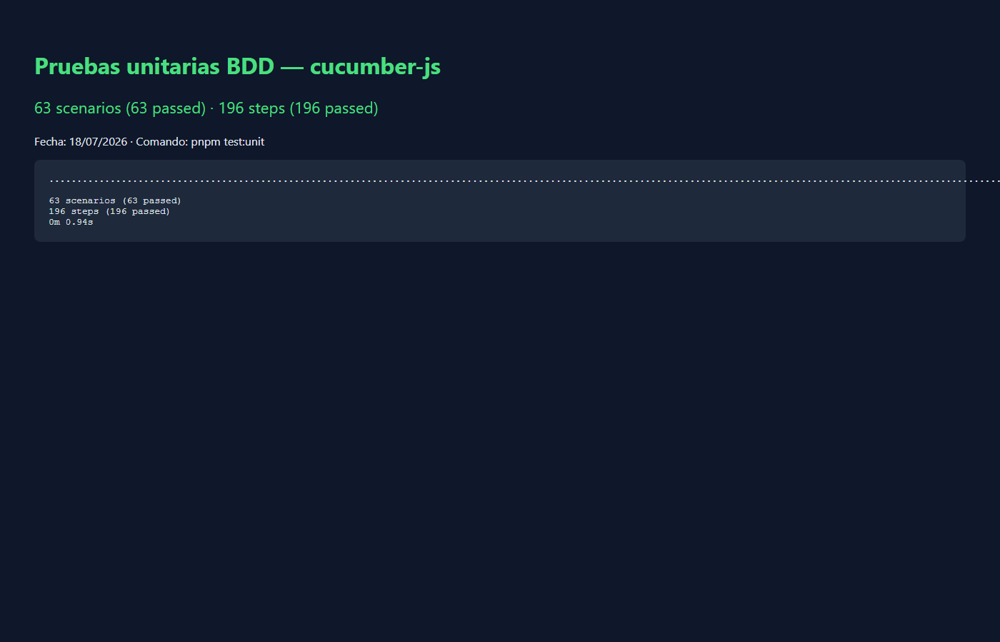
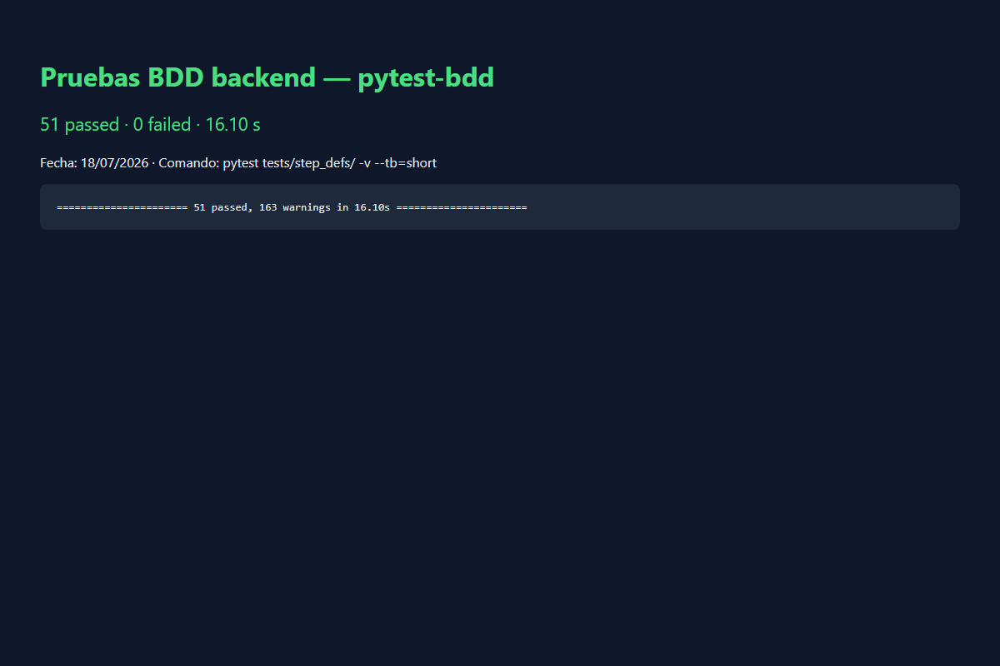

# Reporte de Pruebas Unitarias y BDD — GenOVA

> Pruebas **unitarias / de comportamiento (BDD)** escritas en **Gherkin** y
> ejecutadas **sin navegador** (frontend con cucumber-js) o contra el contrato
> del backend (pytest-bdd). Separado del reporte E2E Playwright
> ([`reporte-pruebas-e2e.md`](reporte-pruebas-e2e.md)).

| Campo | Valor |
|---|---|
| **Proyecto** | GenOVA — generación asistida por IA de OVAs (SCORM 1.2 / 5E) |
| **Tipo de prueba** | Unitarias + BDD (sin browser E2E) |
| **Herramientas** | cucumber-js (frontend) · pytest-bdd (backend) |
| **Fecha de ejecución** | 18/07/2026 |
| **Ejecutado por** | Jeffry A. Romero Uriol |
| **Suite frontend unit** | **63 / 63 PASA** ✔ |
| **Suite backend BDD** | **51 / 51 PASA** ✔ |

---

## 1. Introducción y objetivo

Validar reglas de negocio, validaciones y contratos de servicio descritos en
lenguaje natural (Gherkin), de forma rápida y determinista, sin abrir un
navegador. Complementan las E2E: aquí se prueba la lógica; allí el flujo
integrado UI → API → BD.

## 2. Herramientas y enfoque

| Capa | Runner | Features / steps | Comando |
|---|---|---|---|
| Frontend unit BDD | cucumber-js | `tests/features/**` (subset en `cucumber.unit.config.mjs`) · `tests/steps/unit/` | `pnpm test:unit` |
| Backend BDD | pytest-bdd | features enlazadas desde `backend/tests/step_defs/` | `pytest tests/step_defs/ -v --tb=short` |

- Tags: se excluyen escenarios `@pending-en022` en unit frontend.
- El flujo completo de login/sesión con cookie httpOnly se cubre en E2E y en
  `test_auth_steps.py` del backend, no en features React legacy.

## 3. Entorno de ejecución

| Componente | Detalle |
|---|---|
| Frontend unit | Node + cucumber-js; **sin** backend ni browser |
| Backend BDD | pytest + TestClient / SQLite o BD de prueba según fixture; backend local disponible |
| SO | Windows 11 |
| Fecha | 18/07/2026 |

## 4. Inventario y cobertura

### 4.1 Features en el repositorio (referencia)

| Área | Carpeta | Features | Escenarios (aprox.) |
|---|---|---:|---:|
| Autenticación | `features/auth/` | 8 | 33 |
| OVA | `features/ova/` | 21 | 107 |
| Roles | `features/roles/` | 4 | 18 |
| Administración | `features/admin/` | 3 | 16 |
| Layout | `features/layout/` | 1 | 4 |
| Setup | `features/setup/` | 9 | 45 |
| E2E (browser) | `features/e2e/` | 14 | ver reporte E2E |

### 4.2 Suite unit frontend ejecutada (`cucumber.unit.config.mjs`)

16 features seleccionadas (auth unit, OVA workspace/edición, admin LLM/nodos):

| Área | Features en la corrida | Resultado |
|---|---|:--:|
| Auth (HU-001, BU-001 unit) | 2 | ✔ |
| OVA (HU-022…HU-033 subset) | 12 | ✔ |
| Admin (LLM + nodos) | 2 | ✔ |
| **Total** | **16 features · 63 escenarios · 196 steps** | **63 / 63 ✔** |

### 4.3 Suite de componentes ejecutada (Vitest + Testing Library)

Prueban el componente Angular real montado en un DOM de pruebas (happy-dom),
sin navegador ni backend, con `@testing-library/angular/zoneless`.

| Área | Archivos de especificación | Casos |
|---|---:|---:|
| Workspace y editor de OVA (`features/ova-workspace/`) | 11 | 94 |
| Núcleo y UI compartida (`core/`) | 6 | 30 |
| Otras features (biblioteca, perfil, admin, auth) | 4 | 15 |
| Aplicación (`app/`) | 1 | 1 |
| **Total** | **22** | **140 / 140 ✔** |

Comando: `pnpm --filter frontend test`.

### 4.4 Suite backend pytest-bdd ejecutada

| Módulo `step_defs` | Escenarios | Resultado |
|---|---:|:--:|
| `test_auth_steps` | 5 | ✔ |
| `test_db_api_keys_steps` | 3 | ✔ |
| `test_error_log_steps` | 4 | ✔ |
| `test_jobs_steps` | 14 | ✔ |
| `test_llm_config_steps` | 5 | ✔ |
| `test_nodes_config_steps` | 3 | ✔ |
| `test_ova_critic_steps` | 5 | ✔ |
| `test_ova_editor_steps` | 3 | ✔ |
| `test_ova_steps` | 2 | ✔ |
| `test_roles_steps` | 7 | ✔ |
| **Total** | **51** | **51 / 51 ✔** |

## 5. Ejemplos Gherkin — ruta feliz y camino de error (HU-008 / login)

El contrato de login se ejercita en backend BDD (`test_auth_steps.py`) y en E2E;
el feature documental:

[`tests/features/auth/HU-008_login.feature`](../../tests/features/auth/HU-008_login.feature)

```gherkin
Feature: HU-008 — Inicio de sesión

  Scenario: Login exitoso con credenciales válidas
    Given que estoy en la página de login
    When ingreso un correo registrado y contraseña válida
    And envío el formulario
    Then debo recibir un JWT con expiración de 24 horas
    And debo ser redirigido al dashboard

  Scenario: Login con credenciales inválidas
    Given que estoy en la página de login
    When ingreso credenciales incorrectas
    And envío el formulario
    Then debo ver el mensaje de error "Credenciales inválidas."
```

Otros caminos de error cubiertos en unit/BDD:

- Validaciones de registro — `HU-001_validaciones-unit.feature`
- Expiración de sesión (bus) — `BU-001_expiracion-bus-unit.feature`
- Jobs: dueño, reanudación, no filtrado de secretos — `test_jobs_steps.py`

## 6. Resumen de ejecución

| Suite | Ejecutados | Pasan | Fallan | Duración |
|---|---:|---:|---:|---:|
| Vitest (componentes) | 140 | 140 | 0 | ~9.6 s |
| cucumber-js unit | 63 | 63 | 0 | ~0.94 s |
| pytest-bdd | 51 | 51 | 0 | ~14.2 s |
| **Total** | **254** | **254** | **0** | — |

**Detalle caso por caso:** el [Anexo — Casos de prueba unitarios y BDD](anexo-pruebas-unitarias.md)
recoge una ficha por cada uno de los 254 casos con su escenario, su código y la salida
obtenida. Las tres suites se ejecutaron con reporteros en formato máquina (`json` de
Vitest, `message` de Cucumber y `--junitxml` de pytest), de modo que la salida de cada
ficha procede del ejecutor y no de una transcripción manual.

## 7. Evidencia visual





Logs de consola: `docs/assets/unit-bdd/cucumber-unit-log.txt`,
`docs/assets/unit-bdd/pytest-bdd-log.txt`.

## 8. Cómo reproducir

```bash
# Componentes Angular (Vitest + Testing Library)
pnpm --filter frontend test

# Frontend unit BDD (sin browser ni backend)
pnpm test:unit

# Backend BDD
cd backend
.venv\Scripts\python.exe -m pytest tests/step_defs/ -v --tb=short
```

## 9. Ajustes durante la ejecución

1. **Fixture pytest-bdd** `test_plan_recurso_por_fila`: tras el validador
   `StartJobRequest.validate_resource_types` (catálogo `RECURSOS_META` por fase),
   se actualizaron nombres de recurso del test a los del catálogo real
   (`Infografía Interactiva`, `Estudio de Caso`, `Rúbrica de Autoevaluación`).
   Solo harness de prueba; sin cambio de producto por este reporte.
2. Renombre de fixture `_SECRET` → `_FAKE_API_KEY` (cadena opaca de prueba) para
   evitar falsos positivos del scanner de secretos del agente.
